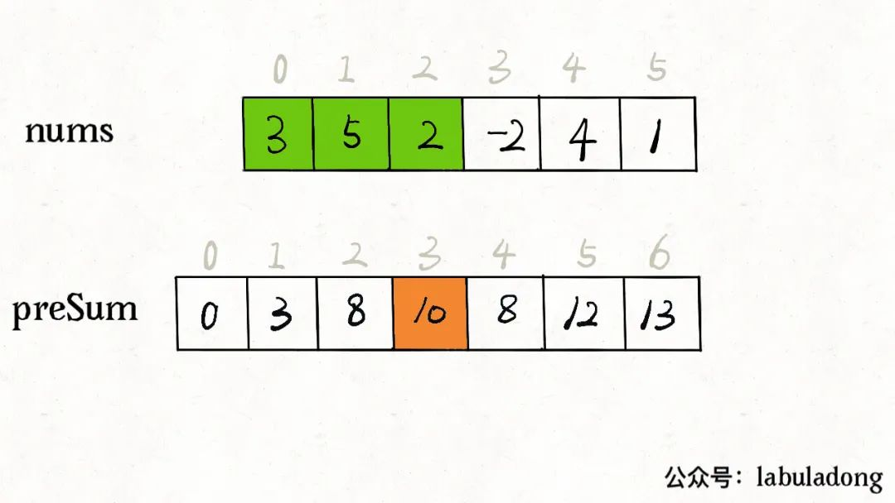
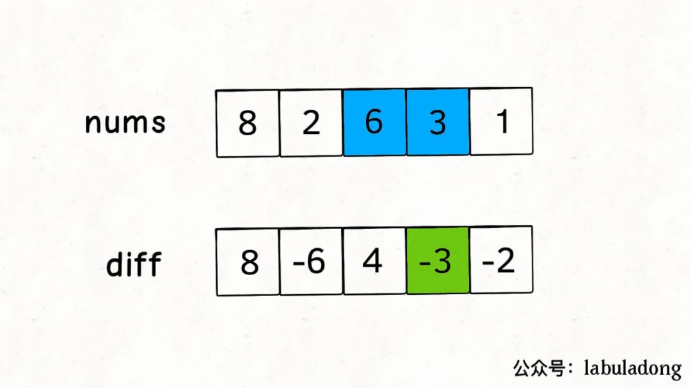
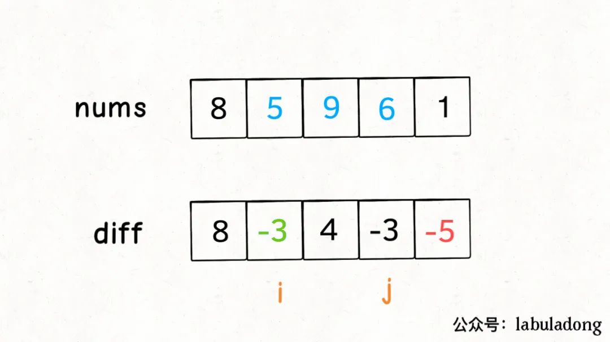

## 概念

:::success 适用场景
差分数组的主要适用场景是频繁对原始数组的某个区间的元素进行增减.
:::

差分数组其实就是 `nums[i] - nums[i - 1]` 组成的数组.



```ts
const nums = [8, 2, 6, 3, 1]
const len = nums.length
const diff = new Array(len)
diff[0] = nums[0]

for (let i = 1; i < len; i++) {
  diff[i] = nums[i] - nums[i - 1]
}

console.log(diff) // [ 8, -6, 4, -3, -2 ]
```

通过差分数组, 我们可以还原出原数组来. 擦, 这不废话吗...



```ts
const diff = [8, -6, 4, -3, -2]
const len = diff.length
const nums = new Array(len)
nums[0] = diff[0]

for (let i = 1; i < len; i++) {
  nums[i] = diff[i] + nums[i - 1]
}

console.log(nums) // [ 8, 2, 6, 3, 1 ]
```

如果我想给某个子数组区间 `nums[i..j]` 的所有元素都增加某个值 `x`, 可以通过 `nums[i] + x`, `nums[j + 1] - x` 来完成.

为什么可以这样呢? 通过上面还原数组的代码可以看出, `nums[i] = diff[i] + nums[i - 1]` 中的 `diff[i]` 增加 x, 那么 `nums[i..最后]` 就会增加 x; 这样再让 `nums[j + 1..最后]` 减少 x, 那么 `nums[i..j]` 的所有元素就都增加 `x`.



## 差分数组的封装

```ts
import assert from 'assert'

interface IDiffArray {
  increment(i: number, j: number, val: number): void
  result(): number[]
}

export class DiffArray implements IDiffArray {
  private diff: number[] = []

  constructor(readonly nums: number[]) {
    assert.ok(nums.length > 0)

    this.diff[0] = nums[0]
    for (let i = 1; i < nums.length; i++) {
      this.diff[i] = nums[i] - nums[i - 1]
    }
  }

  private get len() {
    return this.diff.length
  }

  public increment(i: number, j: number, val: number): void {
    this.diff[i] += val

    if (j + 1 < this.len) {
      this.diff[j + 1] -= val
    }
  }

  public result(): number[] {
    const res = new Array(this.len)
    res[0] = this.diff[0]

    for (let i = 1; i < this.len; i++) {
      res[i] = this.diff[i] + res[i - 1]
    }

    return res
  }
}
```

## 差分数组算法题目合辑

- [1109. 航班预订统计](/leetcode/medium/1109-corp-flight-bookings)
