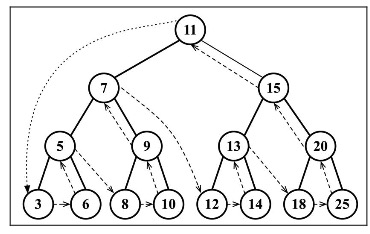

## 基本概念

树是一种**非顺序**数据结构, 前面所学的散列表也是一种非顺序数据结构.

树的每个元素都称为**节点**, 当没有节点是称为**空树**, 节点分为**内部节点**和**外部节点 (也叫叶子节点)**.

**至少有一个子元素**的节点称为内部节点, 如 7.

**没有子元素**的节点称为外部节点或叶子节点, 如 3.

位于树顶部的节点叫做**根节点**, 它是唯一一个没有父节点的节点.

**子树**由它的节点和它的后代构成, 如节点 13、12 和 14 构成了一棵子树.

节点有一个属性叫做**深度**, 它取决于该节点的**祖先节点的数量**, 如节点 3 有 3 个祖先 (5、7 和 11), 它的深度为 3.

树的**高度**取决于**所有节点深度的最大值**, 其中根节点高度值为 0, 因此图片中树的高度为 3.

节点与节点之间的关系称为**边 (edge)**, 在图片中, 边可以认为是两个节点间的连线.

## 二叉树和二叉搜索树

- 二叉树: 最多有两个子节点, 一个是左侧子节点, 一个是右侧子节点.

- 二叉搜索树(BST): 只允许在左侧存储比父节点小的值, 在右侧存储比父节点大的值, 开篇图就是一棵二叉搜索树.

## 树的遍历

树的遍历分为**深度优先遍历(先序遍历, 中序遍历, 后序遍历)**和**广度优先遍历(层序遍历)**.

### 中序遍历

先序遍历是先访问左, 再访问根, 最后访问右. 它会保证从小到大的顺序遍历, 可用来排序.

### 先序遍历

先序遍历是先访问根, 再访问左, 最后访问右. 可用来打印一个结构化的文档.

### 后序遍历

后序遍历是先访问左, 再访问右, 最后访问根. 可以用来计算一个目录及其子目录中所有文件所占空间的大小.

