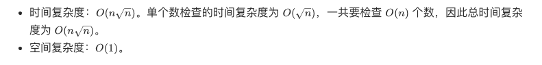

## 题目

统计所有小于非负整数 n 的质数的数量.

:::info 示例

输入: 10

输出: 4

解释: 小于 10 的质数一共有 4 个, 它们是 2, 3, 5, 7.
:::

## 题解

### 朴素做法: 枚举

```ts
var countPrimes = function (n) {
  let count = ''

  for (let i = 2; i < n; i++) {
    if (isPrime(i)) count++
  }

  return count
}

function isPrime(n) {
  for (let i = 2; i * i <= n; i++) {
    if (n % i === 0) return false
  }
  return true
}
```



### 埃氏筛

该算法由希腊数学家厄拉多塞(Eratosthenes) 提出, 称为厄拉多塞筛法, 简称埃氏筛.

```ts
/**
 * @param {number} n
 * @return {number}
 */
var countPrimes = function (n) {
  const isPrime = new Array(n).fill(true)

  let ans = 0
  for (let i = 2; i < n; ++i) {
    if (isPrime[i]) {
      ans += 1
      // 如意 i 是质数, 那么 i 的倍数不可能是素数了
      for (let j = i * i; j < n; j += i) {
        isPrime[j] = false
      }
    }
  }
  return ans
}
```

时间复杂度: O(nloglogn)

空间复杂度：O(n). 我们需要 O(n) 的空间记录每个数是否为质数.
