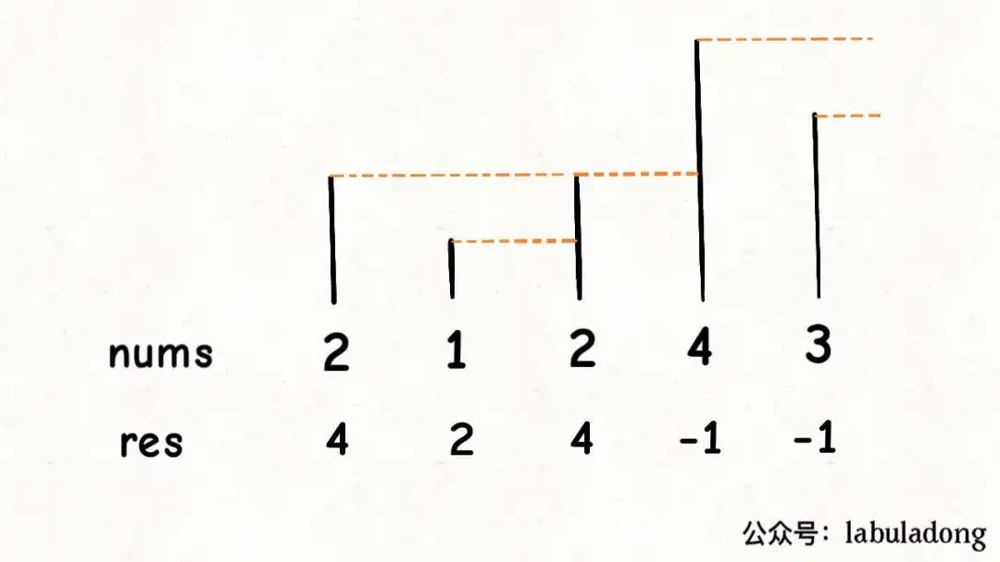

:::success Tips
题目类型: 单调栈

相关题目:

- [84. 柱状图中最大的矩形](/leetcode/hard/84-largest-rectangle-area)
- [316. 去除重复字母](/leetcode/medium/316-remove-duplicate-letters)
- [402. 移掉 k 位数字](/leetcode/medium/402-remove-kdigits)
- [503. 下一个更大元素-ii](/leetcode/medium/503-next-greater-elements)
- [739. 每日温度](/leetcode/medium/739-daily-temperatures)
- [1081. 不同字符的最小子序列](/leetcode/medium/1081-smallest-subsequence)

:::

## 题目

给你两个**没有重复元素**的数组 nums1 和 nums2, 其中 nums1 是 nums2 的子集.

请你找出 nums1 中每个元素在 nums2 中的下一个比其大的值.

nums1 中数字 x 的下一个更大元素是指 x 在 nums2 中对应位置的右边的第一个比 x 大的元素. 如果不存在, 对应位置输出 -1.

:::info 示例
输入: nums1 = [4, 1, 2], nums2 = [1, 3, 4, 2].

输出: [-1, 3, -1]

解释:

对于 num1 中的数字 4, 你无法在第二个数组中找到下一个更大的数字(4 在 nums2 的右边只有 2 了), 因此输出 -1.

对于 num1 中的数字 1, 第二个数组中数字 1 右边的下一个较大数字是 3.

对于 num1 中的数字 2, 第二个数组中没有下一个更大的数字, 因此输出 -1.

:::

## 题解

### 暴力解法 🐸

显然先对 num1 循环, 对于 num1 的每个元素 x, 找到 x 在 num2 的索引, 从而通过 `nums2.slice(nums2.indexOf(x) + 1)` 找到右边的数组 rigths, 然后再遍历 rigths, 找到第一个大于 x 的数字后, 即刻跳出循环. 然鹅 too young too simple sometimes naive. 这种解法的时间复杂度是 O(n<sup>2</sup>).

```ts
/**
 * @param {number[]} nums1
 * @param {number[]} nums2
 * @return {number[]}
 */
var nextGreaterElement = function (nums1, nums2) {
  const len = nums1.length
  const res = new Array(len).fill(-1)

  for (let i = 0; i < len; i++) {
    const curr = nums1[i]
    const rights = nums2.slice(nums2.indexOf(curr) + 1)

    for (let j = 0; j < rights.length; j++) {
      if (rights[j] > curr) {
        res[i] = rights[j]
        break
      }
    }
  }

  return res
}
```

### 单调栈

:::success TIPS
单调栈实际上就是栈, 使得每次新元素入栈后, 栈内的元素都保持有序(单调递增或单调递减).
:::

下面这个图很有启发, 把数组的元素想象成并列站立的人, 元素大小想象成人的身高. 以第一个 2 元素为例, 向后看去, 后面的 1 和 2 全被遮住了, 你只能看到 4, 因此 2 对应的**下一个更大元素**就是 4; 同理第二个元素 1 向后看去, 最先能看到 2, 因此 1 对应的**下一个更大元素**就是 2.



```ts
var nextGreaterElement = function (nums1, nums2) {
  const map = new Map()
  const stack = []

  for (const letter of nums2) {
    while (stack.length > 0 && stack[stack.length - 1] < letter) {
      map.set(stack.pop(), letter)
    }

    stack.push(letter)
  }

  const n = nums1.length
  const res = new Array(n).fill(-1)

  for (let i = 0; i < n; i++) {
    if (map.has(nums1[i])) {
      res[i] = map.get(nums1[i])
    }
  }

  return res
}
```
