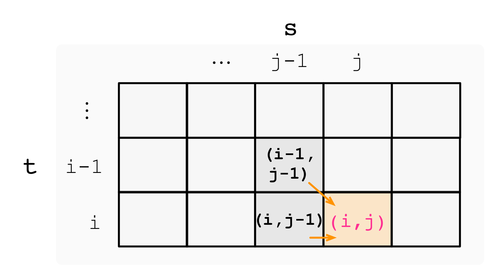

:::success Tips
题目类型: Dynamic Programming

相关题目:

- [44. 通配符匹配](/leetcode/hard/44-is-match)
- [72. 编辑距离](/leetcode/hard/72-min-distance)
- [583. 两个字符串的删除操作](/leetcode/medium/583-min-distance)
- [1143. 最长公共子序列](/leetcode/medium/1143-longest-common-subsequence)

:::

## 题目

给定一个字符串 `s` 和一个字符串 `t`, 计算在 `s` 的子序列中 `t` 出现的个数.

字符串的一个**子序列**是指, 通过删除一些(也可以不删除)字符且不干扰剩余字符相对位置所组成的新字符串. (例如, `"ACE"` 是 `"ABCDE"` 的一个子序列, 而 `"AEC"` 不是).

题目数据保证答案符合 `32` 位带符号整数范围.

提示:

- `0 <= s.length, t.length <= 1000`
- `s` 和 `t` 由英文字母组成

:::info 示例

输入: `s = "babgbag", t = "bag"`

输出: `5`

解释: 有 `5` 种可以从 `s` 中得到 `"bag"` 的方案.

- **ba**b**g**bag
- **ba**bgba**g**
- **b**abgb**ag**
- ba**b**gb**ag**
- babg**bag**

:::

## 题解

import Tabs from '@theme/Tabs'
import TabItem from '@theme/TabItem'

<Tabs>
  <TabItem value="JavaScript - 递归 / 递归记忆化搜索" label="JavaScript - 递归 / 递归记忆化搜索">

对于这种类型的题目, 最朴素的方式是使用递归. 当 `dfs(i)` 到达位置 `i` 时, 无非有两种情况:

- 跳过位置 `i`, 直接考虑下一步;
- 选择 `i`, 并根据实际情况判断选择是否可行, 以及下一步操作如何进行.

在本题中, 我们的目标是在字符串 `s` 中匹配 `t`, 套用常规的递归搜索模板: 记 `dfs(i, j)` 表示匹配到字符 `s[i]` 和 `t[j]` 时的方案数目, 当递归搜索到达 `s[i]` 我们有两种选择:

- 跳过 `s[i]`: 即直接考虑 `s[i + 1]` 与 `t[j]` 进行匹配, 也就是 `dfs(i + 1, j)`;
- 选择 `s[i]`: 在本题中, 当 `s[i] === t[j]` 时才可选择 `s[0]`, 然后下一步考虑 `s[i + 1]` 与 `t[j + 1]` 进行匹配, 即 `dfs(i + 1, j + 1)`.

递归终止的条件为:

- `j = t.length`, 表明找到了一个匹配到 `t` 的方案, 方案数 `+1` 并返回;
- `i = s.length` 且 `j < t.length`, 说明遍历完了 `s` 依然没匹配完 `t` 中的字符, 方案数 `+0` 并返回.

```ts
/**
 * @param {string} s
 * @param {string} t
 * @return {number}
 */
var numDistinct = function (s, t) {
  const dfs = (i, j) => {
    // t 匹配完了
    if (t.length === j) return 1

    // s 匹配完了依然没找到答案
    if (s.length === i) return 0

    let res = 0

    // 跳过 s[i], 并进行下一步搜索: 即 s[i + 1] 与 t[j] 匹配
    res += dfs(i + 1, j)

    // 选择s[i], 并进行下一步搜索
    if (s[i] === t[j]) res += dfs(i + 1, j + 1)

    return res
  }

  // 初始从 s[0] 和 t[0] 开始搜索
  return dfs(0, 0)
}
```

由于朴素递归有大量重复性计算, 因此可以添加记忆化搜索. 由于 JavaScript 中 Map 的 Key 不支持元组, 因此可以用二维数组代替. 相比较 Rust 就比较方便些.

```ts
/**
 * @param {string} s
 * @param {string} t
 * @return {number}
 */
var numDistinct = function (s, t) {
  const memo = new Array(s.length + 1)
    .fill(-1)
    .map(() => new Array(t.length + 1).fill(-1))

  const dfs = (i, j) => {
    if (memo[i][j] !== -1) return memo[i][j]
    if (j === t.length) return 1
    if (i === s.length) return 0

    let res = 0

    res += dfs(i + 1, j)
    if (s[i] === t[j]) res += dfs(i + 1, j + 1)

    memo[i][j] = res

    return res
  }

  return dfs(0, 0)
}
```

</TabItem>

<TabItem value="JavaScript - 二维动态规划" label="JavaScript - 二维动态规划" default>

自上而下的递归搜索过程都可以修改为复杂度更低的自下而上的动态规划过程, 下面介绍一下动态规划的实现方法.

记 `m` 为 `s.length`, `n` 为 `t.length`, 创建二维数组 dp<sub>(m + 1)·(n + 1)</sub>, `dp[i][j]` 表示 `t` 的前 `j` 个连续字符(即 `t[:j]`)在 `s` 的前 `i` 个字符(即`s[:i]`)出现的个数.

- 初始条件: `dp[0][0] = 0`
- 边界条件: 当 `j` 为 `0` 时, `t[:j]` 就是空字符串, 那么如果让 `s[:i]` 变成空字符串, 那只能把 `s` 的前 `i` 个字符全部删掉.
- 状态转移方程:
  - 当 `t[j - 1] !== s[i - 1]`, 相当于在 `s` 中新加入的第 `i` 个字符 `s[i - 1]` 没起到作用, 那么 `dp[i][j] = dp[i - 1][j]`
  - 否则, `dp[i][j]` 可以有两部分组成:
    - 一部分是用 `s[i - 1]` 来匹配, 那么个数为 `dp[i - 1][j - 1]`
    - 一部分是不用 `s[i - 1]` 来匹配, 个数为 `dp[i - 1][j]`

这块当时没搞懂, 既然 `t[j - 1] === s[i - 1]`, 为什么还要考虑不用 `s[i - 1]` 来匹配? 举个例子, `s` 是 `bagg`, `t` 是 `bag`, `s[3]` 和 `t[2]` 是相同的,
因此可以用 `s[3]` 来匹配, 即 `s[0], s[1], s[3]` 组成的 `bag`; 但是字符串 `s` 也可以不用 `s[3]` 来匹配，比如使用 `s[0], s[1], s[2]` 组成的 `bag`.

因此对于 `t[j - 1] === s[i - 1]` 的状态转移方程为: `dp[i][j] = dp[i - 1][j] + dp[i - 1][j - 1]`.

用二维数组表示如下:



下图以 `t = bag`, `s = babgbag` 为例, 展示了这一流程:


```ts
/**
 * @param {string} s
 * @param {string} t
 * @return {number}
 */
var numDistinct = function (s, t) {
  const m = s.length
  const n = t.length
  if (n > m) return 0
  const dp = new Array(m + 1).fill(0).map(() => new Array(n + 1).fill(0))

  for (let i = 0; i <= m; i++) {
    dp[i][0] = 1
  }

  for (let i = 1; i <= m; i++) {
    for (let j = 1; j <= n; j++) {
      if (s[i - 1] !== t[j - 1]) {
        dp[i][j] = dp[i - 1][j]
      } else {
        dp[i][j] = dp[i - 1][j] + dp[i - 1][j - 1]
      }
    }
  }

  return dp[m][n]
}
```

</TabItem>
<TabItem value="Rust - 递归记忆化搜索" label="Rust - 递归记忆化搜索">

```rust
use std::collections::HashMap;

pub fn num_distinct(s: String, t: String) -> i32 {
    let mut memo = HashMap::new();
    dfs(0, 0, &s, &t, &mut memo)
}

fn dfs(i: usize, j: usize, s: &String, t: &String, memo: &mut HashMap<(usize, usize), i32>) -> i32 {
    if memo.contains_key(&(i, j)) {
        return *memo.get(&(i, j)).unwrap();
    }
    if j == t.len() {
        return 1;
    }
    if i == s.len() {
        return 0;
    }

    let mut res = 0;

    res += dfs(i + 1, j, s, t, memo);
    if s.as_bytes()[i] == t.as_bytes()[j] {
        res += dfs(i + 1, j + 1, s, t, memo);
    }

    memo.insert((i, j), res);

    res
}

```

</TabItem>
<TabItem value="Rust - 动态规划" label="Rust - 动态规划">

```rust
pub fn num_distinct(s: String, t: String) -> i32 {
    let (s, t) = (s.as_bytes(), t.as_bytes());
    let (m, n) = (s.len(), t.len());
    let mut dp = vec![vec![0; n + 1]; m + 1];

    for i in 0..m {
        dp[i][0] = 1;
    }

    for i in 1..=m {
        for j in 1..=n {
            if s[i - 1] != t[j - 1] {
                dp[i][j] = dp[i - 1][j];
            } else {
                dp[i][j] = dp[i - 1][j] + dp[i - 1][j - 1];
            }
        }
    }

    dp[m][n]
}
```

</TabItem>
</Tabs>
