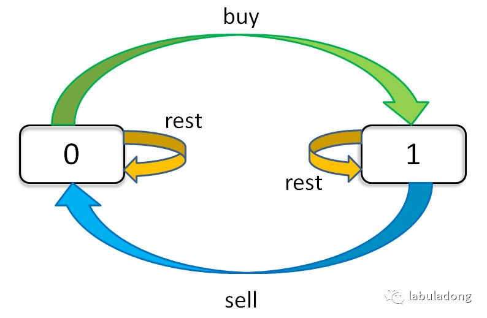

:::success Tips
题目类型: Dynamic Programming
:::

## 题目

给定一个整数数组 `prices`, 它的第 `i` 个元素 `prices[i]` 是一支给定的股票在第 `i` 天的价格. 设计一个算法来计算你所能获取的最大利润. 你最多可以完成 **k** 笔交易. 注意: 你不能同时参与多笔交易(你必须在再次购买前出售掉之前的股票).

:::info 示例

```ts
输入：k = 2, prices = [2,4,1]
输出：2
解释：在第 1 天 (股票价格 = 2) 的时候买入,
      在第 2 天 (股票价格 = 4) 的时候卖出, 这笔交易所能获得利润为 4 - 2 = 2.
```

```ts
输入：k = 2, prices = [3,2,6,5,0,3]
输出：7
解释：在第 2 天 (股票价格 = 2) 的时候买入,
      在第 3 天 (股票价格 = 6) 的时候卖出, 这笔交易所能获得利润为 6 - 2 = 4.
      随后, 在第 5 天 (股票价格 = 0) 的时候买入, 在第 6 天 (股票价格 = 3) 的时候卖出,
      这笔交易所能获得利润为 3 - 0 = 3.
```

:::

## 题解

### 穷举框架

首先我们确认这道题有哪几种选择, 分别是: `买入(buy)`, `卖出(sell)`, `无操作(rest)`. 以上面第二个示例为例:

- 第一天**无操作**
- 第二天**买入**
- 第三天**卖出**
- 第四天**无操作**
- 第五天**买入**
- 第六天**卖出**

然后我们确认有哪几个状态:

- 第一个是**天数**, 我们用 `i` 表示, 那么 `prices[i]` 就是当前日的价格;
- 第二个是**当天允许交易的最大次数**, 因为最大交易次数为 `k` 次, 你得保证当天还存在可交易的次数才行;
- 第三个是**当前的持有状态**, 因为不能同时参与多笔交易, 因此当前你要么持有, 要么不持有, 我们可以用 1 表示持有, 0 表示未持有.

因此我们可以写下伪代码, 比如 `dp[3][2][1]` 代表着第三天, 我现在手上持有着股票, 至今还最多可进行 2 次交易; 再比如 `dp[2][3][0]` 代表着今天是第二天, 我现在手上没有持有股票, 至今还最多可进行 3 次交易.

```ts
// 0 <= i <= n - 1 (n 表示天数)
// 1 <= k <= K (这里的大 K 表示总的允许交易的最大次数)
// 因此总共有 n * K * 2 种可能, 整一波穷举就行
dp[i][k][0 or 1]

for(0 <= i < n) {
  for(1 <= k <= K) {
    for (const s of [0, 1]) {
      dp[i][k][s] = Math.max(buy, sell, rest)
    }
  }
}
```

### 状态转移

上面我们完成了**状态**的穷举, 下面需要思考每种**状态**有哪些**选择**, 应该如何更新**状态**. 我们需要关注的是**持有状态**是如何转移的, 或者说 0 是怎么变成 1 的, 1 是怎么变成 0 的.



- 如果你今天未持有股票, 那么:
  - 昨天未持有, 今天未操作
  - 昨天已持有, 今天卖出了
- 如果你今天持有股票, 那么:
  - 昨天已持有, 今天未操作
  - 昨天未持有, 今天新买入

基于此, 我们可以写出状态转移方程:

```ts
dp[i][k][0] = Math.max(dp[i - 1][k][0], dp[i - 1][k][1] + prices[i])
//          = Math.max('昨天未持有, 今天未操作', '昨天已持有, 今天卖出了')

dp[i][k][1] = Math.max(dp[i - 1][k][1], dp[i - 1][k - 1][0] - prices[i])
//          = Math.max('昨天已持有, 今天未操作', '昨天未持有, 今天新买入')
```

### 定义 base case

- `dp[-1][k][0] = 0`, 因为 `i` 是从 `0` 开始的, `i = -1` 意味着还没开始, 此时利润当然是 `0`
- `dp[-1][k][1] = Number.NEGATIVE_INFINITY`, `i = -1` 意味着还没开始, 根本不可能持有股票, 此时利润写为 `Number.NEGATIVE_INFINITY`
- `dp[i][0][0] = 0`, 因为 `k` 是从 `1` 开始的, `k = 0` 意味着

```ts
/**
 * @param {number} k
 * @param {number[]} prices
 * @return {number}
 */
var maxProfit = function (k, prices) {}
```
