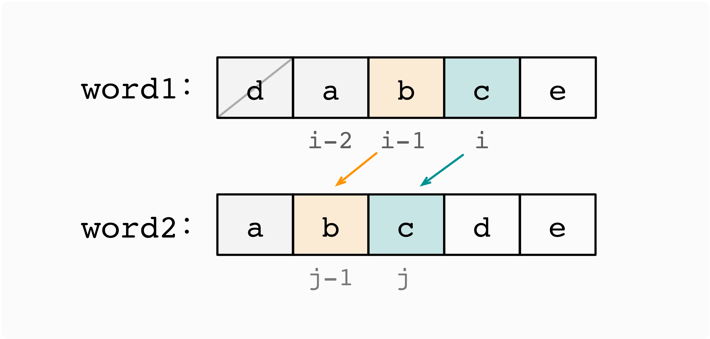

:::success Tips
题目类型: Dynamic Programming

相关题目:

- [10. 正则表达式匹配](/leetcode/hard/10-is-match)
- [44. 通配符匹配](/leetcode/hard/44-is-match)
- [115. 不同的子序列](/leetcode/hard/115-num-distinct)
- [583. 两个字符串的删除操作](/leetcode/medium/583-min-distance)
- [1143. 最长公共子序列](/leetcode/medium/1143-longest-common-subsequence)

:::

## 题目

给你两个单词 `word1` 和 `word2`, 请返回将 `word1` 转换成 `word2` 所使用的最少操作数.

你可以对一个单词进行如下三种操作:

- 插入一个字符
- 删除一个字符
- 替换一个字符

:::note 提示:

- `0 <= word1.length, word2.length <= 500`
- `word1` 和 `word2` 由小写英文字母组成

:::

:::info 示例

```ts
输入: word1 = "horse", word2 = "ros"
输出: 3
解释:
horse -> rorse (将 'h' 替换为 'r')
rorse -> rose (删除 'r')
rose -> ros (删除 'e')
```

```ts
输入: word1 = "intention", word2 = "execution"
输出: 5
解释:
intention -> inention (删除 't')
inention -> enention (将 'i' 替换为 'e')
enention -> exention (将 'n' 替换为 'x')
exention -> exection (将 'n' 替换为 'c')
exection -> execution (插入 'u')
```

:::

## 题解

对于一个单词, 我们有插入, 删除, 替换三种操作. 因此为了将 `word1` 转换成 `word2`:

- 在 `word1` 中插入一个字符等价于在 `word2` 中删除一个字符;
- 在 `word2` 中插入一个字符等价于在 `word1` 中删除一个字符.

因此, 对于 `word1` 的插入, 删除, 替换三种操作我们只需要考虑以下三种情况: 

- `word1` 中删除一个字符;
- `word2` 中删除一个字符(等价于在 `word1` 中插入一个字符);
- `word1` 中替换一个字符.

因此定义二维数组 `dp[i][j]`, 表示 `word1` 前 `i` 个字符和 `word2` 前 `j` 个字符的最小编辑距离.

考虑 `word1` 前 `i` 个字符和 `word2` 前 `j` 个字符的编辑距离, 在此之前:

- `word1` 前 `i - 1` 个字符已完成编辑, `word2` 前 `j - 1` 个字符已完成编辑, 所需最小编辑距离为 `dp[i - 1][j - 1]`;
- `word1` 前 `i - 1` 个字符已完成编辑, `word2` 前 `j` 个字符已完成编辑, 所需最小编辑距离为 `dp[i - 1][j]`;
- `word1` 前 `i` 个字符已完成编辑, `word2` 前 `j - 1` 个字符已完成编辑, 所需最小编辑距离为 `dp[i][j - 1]`.


在进行状态转移的时候, 我们考虑 `word1` 第 `i` 个字符和 `word2` 第 `j` 个字符的匹配情况.

- 当 `word1[i] === word2[j]` 时, 有 `dp[i][j] = dp[i - 1][j - 1]`.



- 当 `word1[i] !== word2[j]` 时, 此时有三种情况:

  - `word1` 删除一个字符, 此时 `dp[i][j] = dp[i - 1][j] + 1`;
  - `word2` 删除一个字符, 此时 `dp[i][j] = dp[i][j - 1] + 1`;
  - `word1` 替换一个字符, 即将 `word1[i]` 替换为 `word2[j]`, 此时 `dp[i][j] = dp[i - 1][j - 1] + 1`.

因此状态转移方程为:

- 当 `word1[i] === word2[j]`, 有 `dp[i][j] = dp[i - 1][j - 1]`;
- 当 `word1[i] !== word2[j]`, 有 `dp[i][j] = Math.min(dp[i - 1][j], dp[i][j - 1], dp[i - 1][j - 1]) + 1`

对于初始化 `dp` 数组, 显然 

- `dp[0][0]` 为 `0`; 
- `dp[i][0]` 为 `i`, 这是因为当 `j` 为 `0` 是, `word2` 前 `j` 个字符是个空字符串, 因此 `word1` 的前 `i` 个字符要想变成空字符串, 一定是要删除 `i` 次.
- `dp[0][j]` 为 `j`, 这是因为当 `i` 为 `0` 是, `word1` 前 `i` 个字符是个空字符串, 因此 `word1` 由空字符串变成 `word2` 前 `j` 个子字符串, 一定是要新增 `j` 次.

import Tabs from '@theme/Tabs'
import TabItem from '@theme/TabItem'

<Tabs>
  <TabItem value="JavaScript" label="JavaScript" default>

```ts
/**
 * @param {string} word1
 * @param {string} word2
 * @return {number}
 */
var minDistance = function (word1, word2) {
  const m = word1.length
  const n = word2.length
  const dp = new Array(m + 1).fill(0).map(() => new Array(n + 1).fill(0))

  for (let i = 0; i <= m; i++) dp[i][0] = i
  for (let j = 0; j <= n; j++) dp[0][j] = j

  for (let i = 1; i <= m; i++) {
    for (let j = 1; j <= n; j++) {
      if (word1[i - 1] === word2[j - 1]) {
        dp[i][j] = dp[i - 1][j - 1]
      } else {
        dp[i][j] = Math.min(dp[i - 1][j], dp[i][j - 1], dp[i - 1][j - 1]) + 1
      }
    }
  }

  return dp[m][n]
}
```

</TabItem>
<TabItem value="Rust" label="Rust">

```rust
pub fn min_distance(word1: String, word2: String) -> i32 {
    let (word1, word2) = (word1.as_bytes(), word2.as_bytes());
    let (m, n) = (word1.len(), word2.len());
    let mut dp = vec![vec![0; n + 1]; m + 1];


    for i in 0..=m {
        dp[i][0] = i as i32;
    }

    for j in 0..=n {
        dp[0][j] = j as i32;
    }

    for i in 1..=m {
        for j in 1..=n {
            if word1[i - 1] == word2[j - 1] {
                dp[i][j] = dp[i - 1][j - 1];
            } else {
                dp[i][j] = cmp::min(dp[i - 1][j - 1], cmp::min(dp[i - 1][j], dp[i][j - 1])) + 1;
            }
        }
    }

    dp[m][n]
}
```

</TabItem>
</Tabs>
