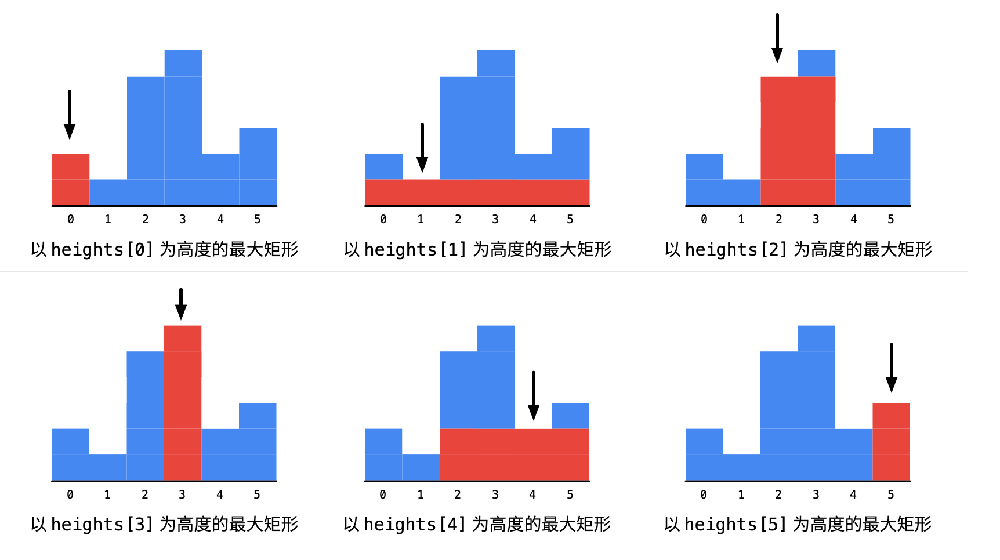

:::success Tips
题目类型: 单调栈

相关题目:

- [85. 最大矩形](/leetcode/hard/85-maximal-rectangle)
- [316. 去除重复字母](/leetcode/medium/316-remove-duplicate-letters)
- [402. 移掉 k 位数字](/leetcode/medium/402-remove-kdigits)
- [496. 下一个更大元素-i](/leetcode/easy/496-next-greater-element)
- [503. 下一个更大元素-ii](/leetcode/medium/503-next-greater-elements)
- [739. 每日温度](/leetcode/medium/739-daily-temperatures)

:::

## 题目

给定非负整数数组 `heights`, 数组中的数字用来表示柱状图中各个柱子的高度. 每个柱子彼此相邻, 且宽度为 `1`. 求在该柱状图中, 能够勾勒出来的矩形的最大面积.

:::note 提示:

- `1 <= heights.length <=10⁵`
- `0 <= heights[i] <= 10⁴`

:::

:::info 示例

```ts
输入: heights = [2, 1, 5, 6, 2, 3]
输出: 10
解释: 最大的矩形为图中红色区域, 面积为 10
```


```ts
输入: heights = [2, 4]
输出: 4
解释: 最大的矩形为图中红色区域, 面积为 4
```


:::

## 题解

不管是暴力解法还是单调栈. 思路都是根据某个 `height`, 比如示例一中 `heights[2]` 这个柱子, 也就是 `5`, 然后往两边扩散, 找到**离这个柱子最近的比它小的柱子**:

- 往左扩散: `heights[1]` 比 `heights[2]` 小, 说明要想维持 `heights[2]` 这个高度, 左边的阈值就得是索引 `1`
- 往右扩散: `heights[4]` 比 `heights[2]` 小, 说明要想维持 `heights[2]` 这个高度, 右边的阈值就得是索引 `4`

这样一来, 维持高度为 `heights[2]` 的最大宽度就是 `4 - 1 - 1 = 2`.



对于暴力解法, 需要遍历每个高度, 然后以此为节点, 再往左往右遍历, 找到左右边界的阈值. 但这会导致 `O(n²)` 的时间复杂度. 因此可以通过空间换时间的策略, 使用单调栈, 来预先找到每个节点左右边界的阈值. 具体原理看注释.

import Tabs from '@theme/Tabs'
import TabItem from '@theme/TabItem'

<Tabs>
  <TabItem value="JavaScript - 暴力解法" label="JavaScript - 暴力解法">

```ts
/**
 * @param {number[]} heights
 * @return {number}
 */
var largestRectangleArea = function (heights) {
  const n = heights.length
  let max = 0

  for (let i = 0; i < n; i++) {
    const height = heights[i]

    let left = i
    while (left > 0 && heights[left - 1] >= height) {
      left--
    }

    let right = i
    while (right < n - 1 && heights[right + 1] >= height) {
      right++
    }

    max = Math.max(max, height * (right - left + 1))
  }

  return max
}
```

- 时间复杂度: `O(n²)`
- 空间复杂度: `O(1)`

</TabItem>
<TabItem value="JavaScript - 单调栈" label="JavaScript - 单调栈" default>

```ts
/**
 * @param {number[]} heights
 * @return {number}
 */
var largestRectangleArea = function (heights) {
  const n = heights.length

  // 从右往左, 找到比当前元素小的左边界
  // 需要理解为什么默认值为 -1, 比如一个元素左边所有元素都比它大,
  // 这就导致从当前高度往左, 一定是可以拉满当前高度的, 那么左边界就是 -1
  //
  // PS: 一开始没想明白为什么是 -1, 而不是 0, 因为存储的是索引, 所以左边界值就要是 -1
  const lefts = new Array(n).fill(-1)

  // 从左往右, 找到比当前元素小的右边界
  // 需要理解为什么默认值为 n, 比如一个元素右边所有元素都比它大,
  // 这就导致从当前高度往右, 一定是可以拉满当前高度的, 那么右边界就是 n
  const rights = new Array(n).fill(n)

  const stack = []

  // 标准的单调栈框架, 找到比当前元素小的右边界
  for (let i = 0; i < n; i++) {
    while (stack.length > 0 && heights[stack[stack.length - 1]] > heights[i]) {
      rights[stack.pop()] = i
    }

    stack.push(i)
  }

  // 标准的单调栈框架, 找到比当前元素小的左边界
  for (let i = n - 1; i >= 0; i--) {
    while (stack.length > 0 && heights[stack[stack.length - 1]] > heights[i]) {
      lefts[stack.pop()] = i
    }

    stack.push(i)
  }

  let max = 0

  // 根据左右边界和当前柱子的高度, 来找到最大值
  for (let i = 0; i < n; i++) {
    max = Math.max(max, (rights[i] - lefts[i] - 1) * heights[i])
  }

  return max
}
```

- 时间复杂度: `O(n)`
- 空间复杂度: `O(n)`

</TabItem>
<TabItem value="Rust" label="Rust">

```rust
use std::cmp;

pub fn largest_rectangle_area(heights: Vec<i32>) -> i32 {
    let n = heights.len();
    let mut left: Vec<isize> = vec![-1; n];
    let mut right = vec![n; n];
    let mut stack = vec![];

    for i in 0..n {
        while !stack.is_empty() && heights[stack[stack.len() - 1]] > heights[i] {
            right[stack.pop().unwrap()] = i;
        }

        stack.push(i);
    }

    for i in (0..n).rev() {
        while !stack.is_empty() && heights[stack[stack.len() - 1]] > heights[i] {
            left[stack.pop().unwrap()] = i as isize;
        }

        stack.push(i);
    }

    let mut max = 0;
    for i in 0..n {
        let height = heights[i];
        let left_idx = left[i];
        let right_idx = right[i];
        max = cmp::max(max, height * (right_idx as i32 - left_idx as i32 - 1));
    }

    max
}
```

  </TabItem>
</Tabs>
