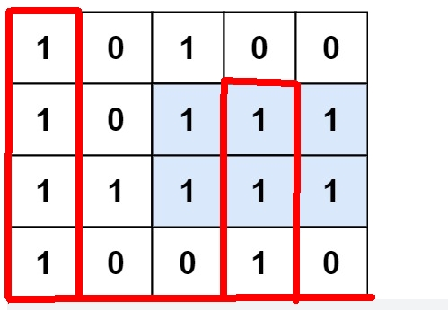
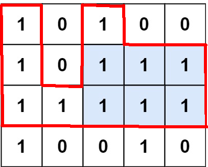

:::success Tips
题目类型: 单调栈

相关题目:

- [84. 柱状图中最大的矩形](/leetcode/hard/84-largest-rectangle-area)
- [316. 去除重复字母](/leetcode/medium/316-remove-duplicate-letters)
- [402. 移掉 k 位数字](/leetcode/medium/402-remove-kdigits)
- [496. 下一个更大元素-i](/leetcode/easy/496-next-greater-element)
- [503. 下一个更大元素-ii](/leetcode/medium/503-next-greater-elements)
- [739. 每日温度](/leetcode/medium/739-daily-temperatures)

:::

## 题目

给定一个仅包含 `0` 和 `1`, 大小为 `rows * cols` 的二维二进制矩阵, 找出只包含 `1` 的最大矩形, 并返回其面积.

:::note 提示:

- `rows == matrix.length`
- `cols == matrix[0].length`
- `1 <= rows, cols <= 200`
- `matrix[i][j]` 为 `0` 或 `1`

:::

:::info 示例


输入: `matrix = [[4, 0, 0, 3, 0], [3, 1, 3, 2, 2], [2, 0, 2, 1, 1], [1, 0, 1, 0, 0]]`

输出: `6`

解释: 最大矩形如上图所示.
:::

## 题解

本题的要点是想办法把二维矩阵变成如下方式:

以最后一行 `row` 为底, 可以得到 `heights` 为 `[4, 0, 0, 3, 0]`.



以倒数第二行 `row` 为底, 可以得到 `heights` 为 `[3, 1, 3, 2, 2`.



以此类推, 我们得到一组 `heights`. 这样我们用 [84. 柱状图中最大的矩形](/leetcode/hard/84-largest-rectangle-area) 题的方法, 便可以获取每个 `heights` 的最大面积, 最后取最大值即可.

import Tabs from '@theme/Tabs'
import TabItem from '@theme/TabItem'

<Tabs>
  <TabItem value="JavaScript" label="JavaScript" default>

```ts
/**
 * @param {character[][]} matrix
 * @return {number}
 */
var maximalRectangle = function (matrix) {
  const m = matrix.length
  const n = matrix[0].length

  const allHeights = []
  for (let i = m - 1; i >= 0; i--) {
    const heights = []

    for (let j = 0; j < n; j++) {
      let maxHeight = 0

      for (let k = i; k >= 0; k--) {
        if (matrix[k][j] === '1') {
          maxHeight++
        } else {
          break
        }
      }

      heights.push(maxHeight)
    }

    allHeights.push(heights)
  }

  let max = 0
  for (const heights of allHeights) {
    max = Math.max(max, largestRectangleArea(heights))
  }

  return max
}

/**
 * @param {number[]} heights
 * @return {number}
 */
var largestRectangleArea = function (heights) {
  const n = heights.length
  const left = new Array(n).fill(-1)
  const right = new Array(n).fill(n)
  const stack = []

  for (let i = 0; i < n; i++) {
    while (stack.length > 0 && heights[stack[stack.length - 1]] > heights[i]) {
      right[stack.pop()] = i
    }

    stack.push(i)
  }

  for (let i = n - 1; i >= 0; i--) {
    while (stack.length > 0 && heights[stack[stack.length - 1]] > heights[i]) {
      left[stack.pop()] = i
    }

    stack.push(i)
  }

  let max = 0

  for (let i = 0; i < n; i++) {
    const height = heights[i]
    const leftIdx = left[i]
    const rightIdx = right[i]
    max = Math.max(max, (rightIdx - leftIdx - 1) * height)
  }

  return max
}
```

</TabItem>
<TabItem value="Rust" label="Rust">

```rust
use std::cmp;

pub fn maximal_rectangle(matrix: Vec<Vec<char>>) -> i32 {
    let m = matrix.len();
    let n = matrix[0].len();

    let mut all_heights = vec![];
    for i in (0..m).rev() {
        let mut heights = vec![];

        for j in (0..n) {
            let mut max_height = 0;

            for k in (0..=i).rev() {
                if matrix[k][j] == '1' {
                    max_height += 1;
                } else {
                    break;
                }
            }

            heights.push(max_height);
        }

        all_heights.push(heights);
    }

    let mut max = 0;

    for heights in all_heights {
        max = cmp::max(max, largest_rectangle_area(heights));
    }

    max
}

fn largest_rectangle_area(heights: Vec<i32>) -> i32 {
    let n = heights.len();
    let mut left: Vec<isize> = vec![-1; n];
    let mut right = vec![n; n];
    let mut stack = vec![];

    for i in 0..n {
        while !stack.is_empty() && heights[stack[stack.len() - 1]] > heights[i] {
            right[stack.pop().unwrap()] = i;
        }

        stack.push(i);
    }

    for i in (0..n).rev() {
        while !stack.is_empty() && heights[stack[stack.len() - 1]] > heights[i] {
            left[stack.pop().unwrap()] = i as isize;
        }

        stack.push(i);
    }

    let mut max = 0;
    for i in 0..n {
        let height = heights[i];
        let left_idx = left[i];
        let right_idx = right[i];
        max = cmp::max(max, height * (right_idx as i32 - left_idx as i32 - 1));
    }

    max
}
```

</TabItem>
</Tabs>
