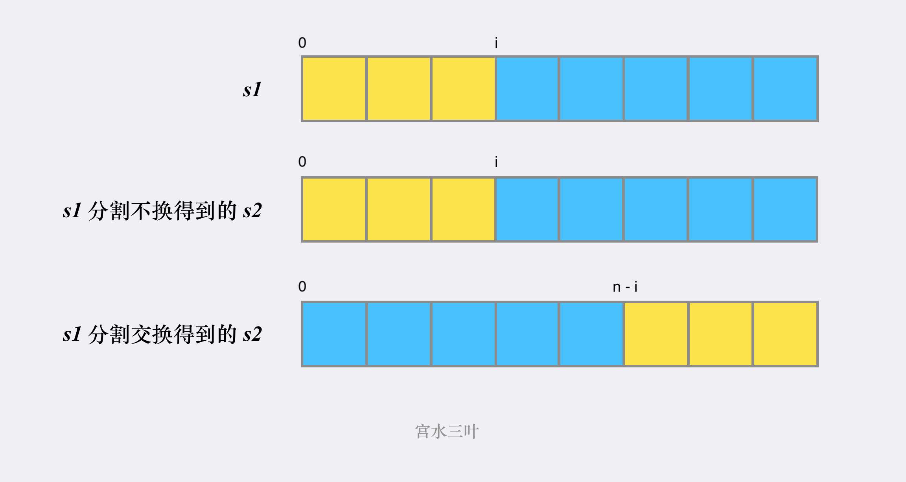

## 题目

使用下面描述的算法可以扰乱字符串 `s` 得到字符串 `t`:

1. 如果字符串的长度为 `1`, 算法停止
2. 如果字符串的长度大于 `1`, 执行下述步骤:
   - 在一个随机下标处将字符串分割成两个非空的子字符串. 即, 如果已知字符串 `s`, 则可以将其分成两个子字符串 `x` 和 `y`, 且满足 `s = x + y`.
   - **随机**决定是要**交换两个子字符串**还是要**保持这两个子字符串的顺序不变**. 即, 在执行这一步骤之后, `s` 可能是 `s = x + y` 或者 `s = y + x`.
   - 在 `x` 和 `y` 这两个子字符串上继续从步骤一开始递归执行此算法.

给你两个**长度相等**的字符串 `s1` 和 `s2`, 判断 `s2` 是否是 `s1` 的扰乱字符串. 如果是, 返回 `true`; 否则, 返回 `false`.

:::note 提示:

- `s1.length == s2.length`
- `1 <= s1.length <= 30`
- `s1` 和 `s2` 由小写英文字母组成

:::

:::info 示例

```bash
输入: s1 = "great", s2 = "rgeat"
输出: true
解释: s1 上可能发生的一种情形是:
"great" --> "gr/eat" // 在一个随机下标处分割得到两个子字符串
"gr/eat" --> "gr/eat" // 随机决定: 保持这两个子字符串的顺序不变
"gr/eat" --> "g/r / e/at" // 在子字符串上递归执行此算法。两个子字符串分别在随机下标处进行一轮分割
"g/r / e/at" --> "r/g / e/at" // 随机决定: 第一组交换两个子字符串, 第二组保持这两个子字符串的顺序不变
"r/g / e/at" --> "r/g / e/ a/t" // 继续递归执行此算法, 将 "at" 分割得到 "a/t"
"r/g / e/ a/t" --> "r/g / e/ a/t" // 随机决定: 保持这两个子字符串的顺序不变
算法终止, 结果字符串和 s2 相同, 都是 "rgeat"
这是一种能够扰乱 s1 得到 s2 的情形, 可以认为 s2 是 s1 的扰乱字符串, 返回 true
```

```bash
输入: s1 = "abcde", s2 = "caebd"
输出: false
```

```bash
输入: s1 = "a", s2 = "a"
输出: true
```

:::

## 题解

一开始看到随机, 还煞有介事的写了一堆 `Math.random`, 实际上可以理解为人家让你找出所有 `s1` 变换成扰乱字符串的形态,
只要有一个与 `s2` 相同, 就证明 `s2` 是 `s1` 的扰乱字符串.

import Tabs from '@theme/Tabs'
import TabItem from '@theme/TabItem'

<Tabs>
  <TabItem value="JavaScript - 暴力递归" label="JavaScript - 暴力递归" default>

最朴素的是使用暴力递归, 中止条件要保证两个子字符串的长度相等, 且值相等. 然后分割 `s1` 和 `s2` 两个字符串, 由于 `s2` 可以被组装成 `x + y` 的形式, 也可能被组装成 `y + x` 的情况, 都需要考虑到.



```ts
/**
 * @param {string} s1
 * @param {string} s2
 * @return {boolean}
 */
var isScramble = function (s1, s2) {
  const dfs = (s1, s2) => {
    if (s1.length !== s2.length) return false
    if (s1 === s2) return true

    const n = s1.length
    for (let i = 1; i < n; i++) {
      // 按索引 i 切割 s1 字符串
      const x = s1.slice(0, i), // 黄色区域
        y = s1.slice(i) // 蓝色区域

      // 按索引 i 切割 s2 字符串, 不需要交换
      const a = s2.slice(0, i), // 黄色区域
        b = s2.slice(i) // 蓝色区域

      // 按索引 i 切割 s2 字符串, 需要交换
      const c = s2.slice(0, n - i), // 蓝色区域
        d = s2.slice(n - i) // 黄色区域

      if ((dfs(x, a) && dfs(y, b)) || (dfs(x, d) && dfs(y, c))) return true
    }

    return false
  }

  return dfs(s1, s2)
}
```

</TabItem>
<TabItem value="JavaScript - 记忆化搜索" label="JavaScript - 记忆化搜索">

扰乱不影响长度, 所以扰乱前的长度等于扰乱后的长度; 扰乱也不改变字符, 所以扰乱前的字符频次等于扰乱后的字符频次. 因此我们可以按着这个思路优化.

```ts
/**
 * @param {string} s1
 * @param {string} s2
 * @return {boolean}
 */
var isScramble = function (s1, s2) {
  const cache = new Map()

  const dfs = (s1, s2) => {
    if (s1.length !== s2.length) return false
    if (s1 === s2) return true

    // 扰乱前的字符频次等于扰乱后的字符频次, 如果不相等可以提前终止
    if (!check(s1, s2)) return false

    // 由于在暴力递归中会重复用到相同的 s1 和 s2, 这里记录一下, 作为记忆化 cache
    const key = s1 + '_' + s2
    if (cache.has(key)) return cache.get(key)

    const n = s1.length
    for (let i = 1; i < n; i++) {
      const x = s1.slice(0, i),
        y = s1.slice(i)

      const a = s2.slice(0, i),
        b = s2.slice(i),
        c = s2.slice(0, n - i),
        d = s2.slice(n - i)

      if ((dfs(x, a) && dfs(y, b)) || (dfs(x, d) && dfs(y, c))) {
        cache.set(key, true)
        return true
      }
    }

    cache.set(key, false)
    return false
  }

  return dfs(s1, s2)
}

/**
 * @param {string} s1
 * @param {string} s2
 * @return {boolean}
 */
const check = (s1, s2) =>
  // 这里受到第 49 题的启发, 可以通过给字符串按字母表排序来校验频次是否相等
  s1.split('').sort().join('') === s2.split('').sort().join('')
```

- 时间复杂度: `O(n⁴)`
- 空间复杂度: `O(n³)`

</TabItem>
<TabItem value="JavaScript - 动态规划" label="JavaScript - 动态规划">

氛围烘托到这儿了, 不写个动态规划就说不过去了. `dp[i][j][len]` 代表 `s1` 从 `i` 开始,
`s2` 从 `j` 开始, 后面长度为 `len` 的字符是否能形成扰乱字符串.

```ts
/**
 * @param {string} s1
 * @param {string} s2
 * @return {boolean}
 */
var isScramble = function (s1, s2) {
  if (s1 === s2) return true

  const n = s1.length
  const dp = new Array(n)
    .fill(false)
    .map(() => new Array(n).fill(false).map(() => new Array(n + 1).fill(false)))

  // 当 len 为 1, 只需比较两个字符相等即可
  for (let i = 0; i < n; i++) {
    for (let j = 0; j < n; j++) {
      dp[i][j][1] = s1[i] === s2[j]
    }
  }

  // 从 len > 1 开始遍历
  for (let len = 2; len <= n; len++) {
    // 遍历两个字符串
    for (let i = 0; i <= n - len; i++) {
      for (let j = 0; j <= n - len; j++) {
        // 分割
        for (let k = 1; k < len; k++) {
          // 对应了不发生交换
          const planA = dp[i][j][k] && dp[i + k][j + k][len - k]

          // 对应了发生了交换
          const planB = dp[i][j + len - k][k] && dp[i + k][j][len - k]

          if (planA || planB) {
            dp[i][j][len] = true
          }
        }
      }
    }
  }
  return dp[0][0][n]
}
```

- 时间复杂度: `O(n⁴)`
- 空间复杂度: `O(n³)`

</TabItem>
<TabItem value="Rust" label="Rust">

```rust
use std::collections::HashMap;
 fn is_scramble(s1: String, s2: String) -> bool {
    let mut cache = HashMap::new();
    dfs(&s1, &s2, &mut cache)
}

fn dfs(s1: &str, s2: &str, cache: &mut HashMap<String, bool>) -> bool {
    if s1.len() != s2.len() {
        return false;
    }

    if s1 == s2 {
        return true;
    }

    if !check(&s1, &s2) {
        return false;
    }

    let key = s1.to_string() + "_" + s2;
    if let Some(x) = cache.get(&key) {
        return *x;
    }

    let n = s1.len();
    for i in 1..n {
        let (x, y) = (&s1[0..i], &s1[i..]);
        let (a, b) = (&s2[0..i], &s2[i..]);
        let (c, d) = (&s2[0..(n - i)], &s2[(n - i)..]);

        if (dfs(x, a, cache) && dfs(y, b, cache)) || (dfs(x, d, cache) && dfs(y, c, cache)) {
            cache.entry(key.to_string()).or_insert(true);
            return true;
        }
    }

    cache.entry(key.to_string()).or_insert(false);
    false
}

fn check(s1: &str, s2: &str) -> bool {
    let mut s1 = s1.split("").collect::<Vec<&str>>();
    s1.sort();
    s1.join("");

    let mut s2 = s2.split("").collect::<Vec<&str>>();
    s2.sort();
    s2.join("");

    s1 == s2
}
```

</TabItem>
</Tabs>
