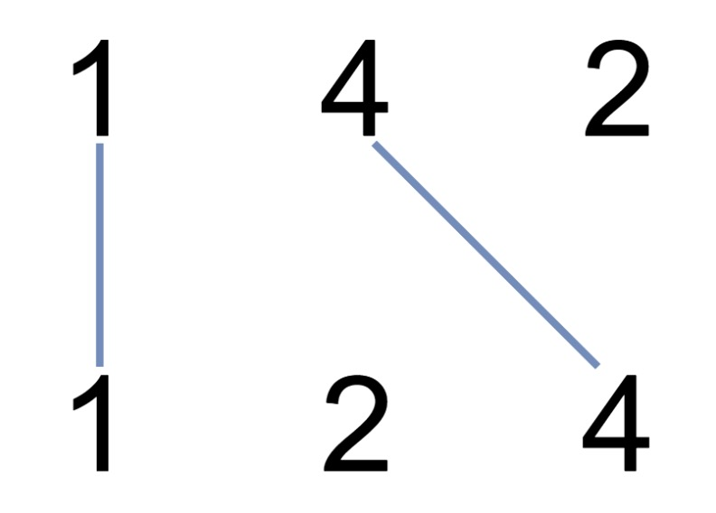

:::success Tips
题目类型: Dynamic Programming

相关题目:

- [10. 正则表达式匹配](/leetcode/hard/10-is-match)
- [44. 通配符匹配](/leetcode/hard/44-is-match)
- [53. 最大子序和](/leetcode/medium/53-max-sub-array)
- [72. 编辑距离](/leetcode/medium/72-min-distance)
- [115. 不同的子序列](/leetcode/hard/115-num-distinct)
- [300. 最长递增子序列](/leetcode/medium/300-length-of-lis)
- [516. 最长回文子序列](/leetcode/medium/516-longest-palindrome-subseq)
- [583. 两个字符串的删除操作](/leetcode/medium/583-min-distance)
- [647. 回文子串](/leetcode/medium/647-count-substrings)
- [1143. 最长公共子序列](/leetcode/medium/1143-longest-common-subsequence)

:::

## 题目

在两条独立的水平线上按给定的顺序写下 `nums1` 和 `nums2` 中的整数.

现在, 可以绘制一些连接两个数字 `nums1[i]` 和 `nums2[j]` 的直线, 这些直线需要同时满足:

- `nums1[i] == nums2[j]`
- 且绘制的直线不与任何其他连线(非水平线)相交.

请注意, 连线即使在端点也不能相交: 每个数字只能属于一条连线.

以这种方法绘制线条, 并返回可以绘制的最大连线数.

:::note 提示:

- `1 <= nums1.length, nums2.length <= 500`
- `1 <= nums1[i], nums2[j] <= 2000`

:::

:::info 示例



```bash
输入: nums1 = [1,4,2], nums2 = [1,2,4]
输出: 2
解释: 可以画出两条不交叉的线, 如上图所示.
但无法画出第三条不相交的直线, 因为从 nums1[1]=4 到 nums2[2]=4 的直线将与从 nums1[2]=2 到 nums2[1]=2 的直线相交.
```

```bash
输入: nums1 = [2,5,1,2,5], nums2 = [10,5,2,1,5,2]
输出: 3
```

```bash
输入: nums1 = [1,3,7,1,7,5], nums2 = [1,9,2,5,1]
输出: 2
```

:::

## 题解

这里是题解这里是题解这里是题解这里是题解这里是题解

import Tabs from '@theme/Tabs'
import TabItem from '@theme/TabItem'

<Tabs>
  <TabItem value="JavaScript" label="JavaScript" default>

```ts
/**
 * @param {number[]} nums1
 * @param {number[]} nums2
 * @return {number}
 */
var maxUncrossedLines = function (nums1, nums2) {}
```

</TabItem>
<TabItem value="Rust" label="Rust">

```rust
pub fn foo() -> () {
}
```

</TabItem>
</Tabs>
