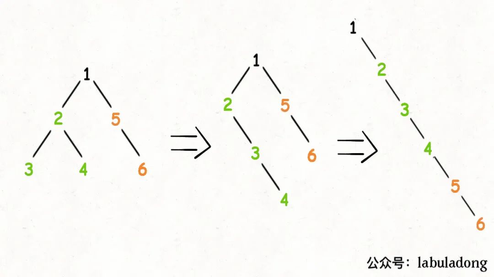

## 题目

给你二叉树的根结点 root, 请你将它展开为一个单链表: 展开后的单链表应该同样使用 TreeNode(即不能创建额外的树), 其中 right 子指针指向链表中下一个结点, 而左子指针始终为 null. 展开后的单链表应该与二叉树**先序遍历**顺序相同.

:::info 示例

输入:

```ts
    1
   /   \
  2     5
 / \     \
3   4    6
```

输出:

```ts
    1
     \
      2
       \
        3
         \
          4
           \
            5
             \
              6
```

:::

## 题解



后序遍历顺序: 3 4 2 6 5 1

```ts
/**
 * Definition for a binary tree node.
 * function TreeNode(val, left, right) {
 *     this.val = (val===undefined ? 0 : val)
 *     this.left = (left===undefined ? null : left)
 *     this.right = (right===undefined ? null : right)
 * }
 */
/**
 * @param {TreeNode} root
 * @return {void} Do not return anything, modify root in-place instead.
 */
var flatten = function (root) {
  if (!root) return root

  flatten(root.left)
  flatten(root.right)

  // 1、后序遍历: 左右子树已经被拉平成一条链表
  const left = root.left
  const right = root.right

  // 2、将左子树作为右子树
  root.left = null
  root.right = left

  // 3、将原先的右子树接到当前右子树的末端
  let p = root
  while (p.right !== null) {
    p = p.right
  }
  p.right = right
}
```
