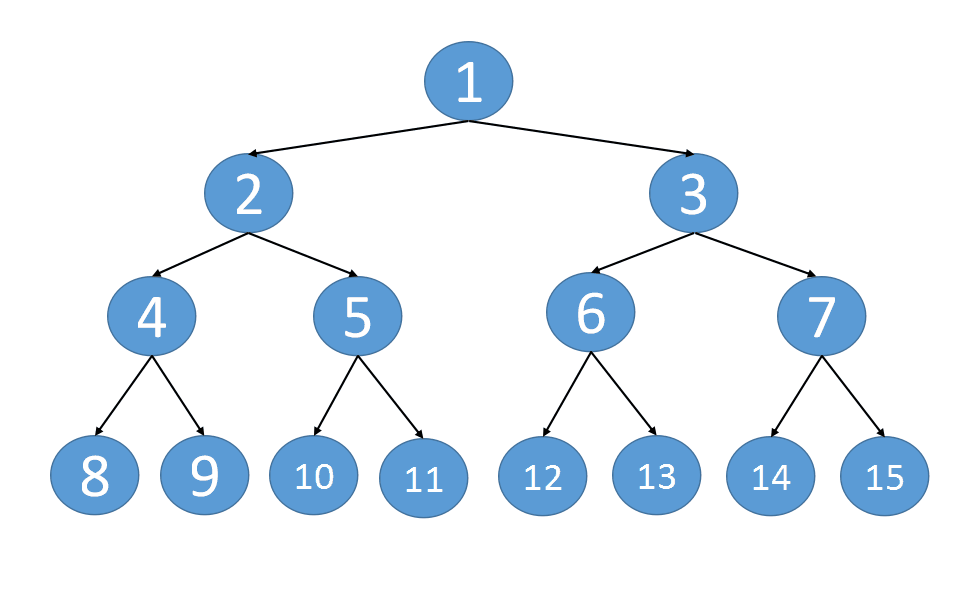

:::success Tips
题目类型: Tree
:::

## 题目

给定一个**完美二叉树**, 其所有叶子节点都在同一层, 每个父节点都有两个子节点. 二叉树定义如下:

```c
struct Node {
  int val;
  Node *left;
  Node *right;
  Node *next;
}
```

填充它的每个 next 指针, 让这个指针指向其下一个右侧节点. 如果找不到下一个右侧节点, 则将 next 指针设置为 NULL 初始状态下, 所有 next 指针都被设置为 NULL.

**进阶:**

你只能使用**常量级额外空间**.

使用递归解题也符合要求, 本题中递归程序占用的栈空间不算做额外的空间复杂度.

:::info 示例

输入:

```ts
     1
   /   \
  2     3
 / \    / \
4   5  6   7
```

输出:

```ts
     1 -> null
   /   \
  2 ->  3 -> null
 / \    / \
4 ->5->6-> 7 -> null
```

:::

## 题解

### 解法一

最朴素的解法, 使用层序遍历, 让每层的元素逐一连接起来, 但这样时间复杂度和空间复杂度均为 O(n)

```ts
/**
 * // Definition for a Node.
 * function Node(val, left, right, next) {
 *    this.val = val === undefined ? null : val;
 *    this.left = left === undefined ? null : left;
 *    this.right = right === undefined ? null : right;
 *    this.next = next === undefined ? null : next;
 * };
 */

/**
 * @param {Node} root
 * @return {Node}
 */
var connect = function (root) {
  if (root !== null) {
    const queue = [root]

    while (queue.length !== 0) {
      const len = queue.length

      // 遍历这一层的所有节点
      for (let i = 0; i < len; i++) {
        const curr = queue.shift()

        // 连接
        if (i < len - 1) {
          curr.next = queue[0]
        }

        // 拓展下一层节点
        if (curr.left !== null) {
          queue.push(curr.left)
        }
        if (curr.right !== null) {
          queue.push(curr.right)
        }
      }
    }
  }

  return root
}
```

### 解法二

一棵树中存在两种 next 类型(下面以 node 为 2 那个节点说明):

1. **某个 node 节点的左子节点和左子节点连接**, 如 4, 5 两个节点, 它们其实是 2 的子节点, 如果连接的话, 即 `node.left.next = node.right`


2. **某个 node 节点的右子节点和另一个 node 节点的左子节点连接**, 如 5, 6 两个节点. 对于这种情况, 可以和上面结合起来一起看, 5 实际就是 `node.right`, 而 6 实际就是 `node.next.left` (注: node.next 是 3), 如果连接的话, 即 `node.right.next = node.next.left`


时间复杂度: 和
空间复杂度均为 O(n)

```ts
var connect = function (root) {
  if (root === null) {
    return root
  }

  // 从根节点开始
  let leftmost = root

  while (leftmost.left !== null) {
    // 遍历这一层节点组织成的链表, 为下一层的节点更新 next 指针
    let head = leftmost

    while (head !== null) {
      // CONNECTION 1: 某个节点的直接左右子节点连接
      head.left.next = head.right

      // CONNECTION 2: 某个节点的右子节点和另一个节点的左子节点连接
      if (head.next !== null) {
        head.right.next = head.next.left
      }

      // 指针向后移动
      head = head.next
    }

    // 去下一层的最左的节点
    leftmost = leftmost.left
  }

  return root
}
```

时间复杂度: O(N), 每个节点只访问一次

空间复杂度: O(1), 不需要存储额外的节点

### 解法三



以当前节 root 点为起始, 左右节点不断的深入下面, **left 节点不断往右走, right 节点不断往左走, 当这两个节点走到底后, 单个纵深就完成了串联**.

递归函数实现如下:

终止条件: 当前节点为空时

函数内: 以当前节点为起始, 完成从上往下的纵深串联, 再递归的调用当前节点 left 和 right

```ts
function connect(root) {
  dfs(root)
  return root
}

function dfs(root) {
  if (root == null) {
    return
  }
  let left = root.left
  let right = root.right

  // 以 root 为起点, 将单个纵深这段串联起来
  while (left != null) {
    left.next = right
    left = left.right
    right = right.left
  }

  // 递归的调用左右节点, 完成同样的纵深串联
  dfs(root.left)
  dfs(root.right)
}
```

时间复杂度: O(n)
空间复杂度: O(h), h 是树的高度
