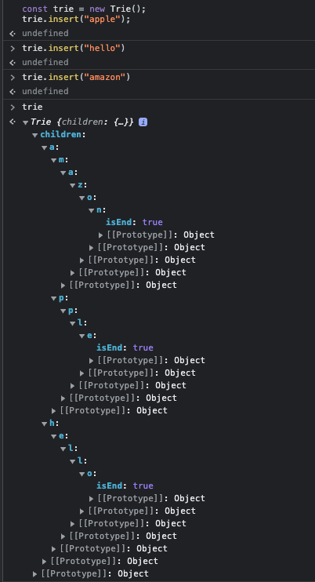

## 题目

Trie(前缀树 / 字典树)是一种树形数据结构, 用于高效地存储和检索字符串数据集中的键. 这一数据结构有相当多的应用情景, 例如自动补完和拼写检查.

请你实现 Trie 类:

- `Trie()` 初始化前缀树对象.
- `void insert(String word)` 向前缀树中插入字符串 `word`.
- `boolean search(String word)` 如果字符串 `word` 在前缀树中, 返回 `true`(即, 在检索之前已经插入); 否则, 返回 `false`.
- `boolean startsWith(String prefix)` 如果之前已经插入的字符串 `word` 的前缀之一为 `prefix`, 返回 `true`; 否则, 返回 `false`.

:::info 示例

```ts
Trie trie = new Trie();
trie.insert("apple");
trie.search("apple");   // 返回 True
trie.search("app");     // 返回 False
trie.startsWith("app"); // 返回 True
trie.insert("app");
trie.search("app");     // 返回 True
```

:::

## 题解

首先看下前缀树长什么样子, 再写就很简单了.



```ts
/**
 * Initialize your data structure here.
 */
var Trie = function () {
  this.children = {}
}

/**
 * Inserts a word into the trie.
 * @param {string} word
 * @return {void}
 */
Trie.prototype.insert = function (word) {
  let node = this.children

  for (const ch of word) {
    if (!node[ch]) {
      node[ch] = {}
    }
    node = node[ch]
  }
  node.isEnd = true
}

/**
 * Returns if the word is in the trie.
 * @param {string} word
 * @return {boolean}
 */
Trie.prototype.search = function (word) {
  const node = this.searchPrefix(word)
  return node !== undefined && node.isEnd !== undefined
}

/**
 * Returns if there is any word in the trie that starts with the given prefix.
 * @param {string} prefix
 * @return {boolean}
 */
Trie.prototype.startsWith = function (prefix) {
  return this.searchPrefix(prefix)
}

Trie.prototype.searchPrefix = function (prefix) {
  let node = this.children
  for (const ch of prefix) {
    if (!node[ch]) {
      return false
    }
    node = node[ch]
  }
  return node
}

/**
 * Your Trie object will be instantiated and called as such:
 * var obj = new Trie()
 * obj.insert(word)
 * var param_2 = obj.search(word)
 * var param_3 = obj.startsWith(prefix)
 */
```
