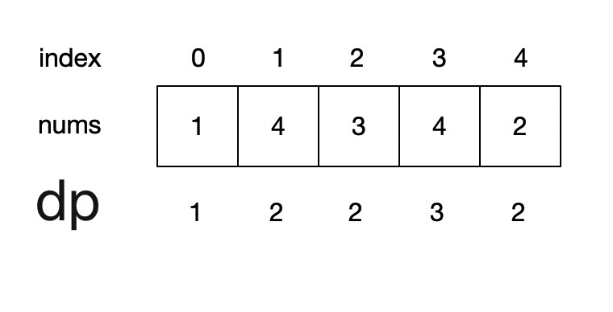
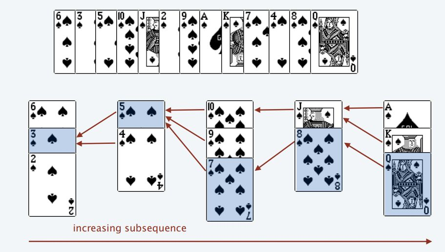

:::success Tips
Topics: Dynamic Programming, Binary Search

Similar Questions:

- [673. 最长递增子序列的个数](/leetcode/medium/673-find-number-of-lis)

:::

## Description

Given an integer array `nums`, return _the length of the longest **strictly increasing subsequencee**_.

> A subsequence is an array that can be derived from another array by deleting some or no elements without changing the order of the remaining elements.

:::note Constraints:

- `1 <= nums.length <= 2500`
- `-10⁴ <= nums[i] <= 10⁴`

:::

:::info Examples

```bash
Input: nums = [10,9,2,5,3,7,101,18]
Output: 4
Explanation: The longest increasing subsequence is [2,3,7,101], therefore the length is 4.
```

```bash
Input: nums = [0,1,0,3,2,3]
Output: 4
```

```bash
Input: nums = [7,7,7,7,7,7,7]
Output: 1
```

:::

## Solution

import Tabs from '@theme/Tabs'
import TabItem from '@theme/TabItem'

<Tabs>
  <TabItem value="JavaScript - Dynamic Programming" label="JavaScript - Dynamic Programming" default>

`dp[i]` 表示 `i` 之前包括 `i` 的以 `nums[i]` 结尾的最长递增子序列的长度,
位置 `i` 的最长升序子序列等于 `j` 从 `0` 到 `i - 1` 各个位置的最长升序子序列 `+ 1` 的最大值.



```ts
/**
 * @param {number[]} nums
 * @return {number}
 */
var lengthOfLIS = function (nums) {
  const n = nums.length
  let max = 1
  const dp = new Array(n).fill(1)

  for (let i = 1; i < n; i++) {
    for (let j = 0; j < i; j++) {
      if (nums[j] < nums[i]) {
        dp[i] = Math.max(dp[i], dp[j] + 1)
      }
    }

    max = Math.max(max, dp[i])
  }

  return max
}
```

- Time complexity: O(n²).
- Space complexity: O(n).

</TabItem>
<TabItem value="JavaScript - Binary Search" label="JavaScript - Binary Search">



```ts
var lengthOfLIS = function (nums) {
  const n = nums.length
  const top = new Array(n)
  let piles = 0

  for (let i = 0; i < n; i++) {
    let pocker = nums[i]

    let left = 0,
      right = piles

    while (left < right) {
      const mid = Math.floor((left + right) / 2)

      if (top[mid] > pocker) {
        right = mid
      } else if (top[mid] < pocker) {
        left = mid + 1
      } else {
        right = mid
      }
    }

    if (left === piles) piles++
    top[left] = pocker
  }

  return piles
}
```

- Time complexity: O(nlogn).
- Space complexity: O(n).

</TabItem>
<TabItem value="Rust" label="Rust">

```rust
use std::cmp;

pub fn length_of_lis(nums: Vec<i32>) -> i32 {
    let n = nums.len();
    let mut dp = vec![1; n];
    let mut max = 1;

    for i in 0..n {
        for j in 0..i {
            if nums[j] < nums[i] {
                dp[i] = cmp::max(dp[i], dp[j] + 1);
            }
        }

        max = cmp::max(max, dp[i]);
    }

    max
}

```

</TabItem>
</Tabs>
