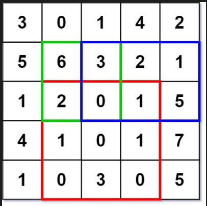

:::success Tips
题目类型: 二维前缀和
:::

## 题目

给定一个二维矩阵 `matrix`, 以下类型的多个请求:

- 计算其子矩形范围内元素的总和, 该子矩阵的**左上角**为 `(row1, col1)` ,**右下角**为 `(row2, col2)`.

实现 `NumMatrix` 类:

- `NumMatrix(int[][] matrix)` 给定整数矩阵 `matrix` 进行初始化
- `int sumRegion(int row1, int col1, int row2, int col2)` 返回**左上角** `(row1, col1)`, **右下角** `(row2, col2)` 所描述的子矩阵的元素总和.

:::info 示例



输入: 二维数组如上图, 红框的坐标为 (2, 1, 4, 3); 绿框的坐标为 (1, 1, 2, 2); 蓝框的坐标为 (1, 2, 2, 4)

输出: 分别输出 8, 11, 12
:::

## 题解

import Tabs from '@theme/Tabs'
import TabItem from '@theme/TabItem'

<Tabs>
  <TabItem value="一维前缀和" label="一维前缀和" default>

一维的比较好理解, 先把二维数组拆成一维数组, 添加到前缀和中; 然后**逐行**计算每个子数组的和, 累加到一起.

```ts
/**
 * @param {number[][]} matrix
 */

var NumMatrix = function (matrix) {
  this.m = matrix.length
  this.n = matrix[0].length
  if (this.m > 0) {
    this.preSum = new Array(this.m * this.n + 1).fill(0)

    // 遍历二维数组的每个元素, 添加到前缀和 preSum 中
    for (let i = 0; i < this.m; i++) {
      for (let j = 0; j < this.n; j++) {
        const element = matrix[i][j]
        this.preSum[i * this.n + (j + 1)] =
          this.preSum[i * this.n + j] + element
      }
    }
  }
}

/**
 * @param {number} row1
 * @param {number} col1
 * @param {number} row2
 * @param {number} col2
 * @return {number}
 */

NumMatrix.prototype.sumRegion = function (row1, col1, row2, col2) {
  let sum = 0

  // 逐行遍历, 比如示例中的红框, 需要分别计算如下三个子数组(数字为索引)的累加和:
  // 11 - 13
  // 16 - 18
  // 21 - 23
  // 然后把这个三个子数组加到一起, 便是这个框的加和
  for (let i = 0; i <= row2 - row1; i++) {
    const start = (row1 + i) * this.n + col1
    const end = (row1 + i) * this.n + col2
    sum += this.preSum[end + 1] - this.preSum[start]
  }

  return sum
}

/**
 * Your NumMatrix object will be instantiated and called as such:
 * var obj = new NumMatrix(matrix)
 * var param_1 = obj.sumRegion(row1,col1,row2,col2)
 */
```

时间复杂度: O(m \* n), 每次检索复杂度为 O(m). m 和 n 分别为矩阵的 row 和 col

空间复杂度: O(m \* n), m 和 n 分别为矩阵的 row 和 col

  </TabItem>

  <TabItem value="二维前缀和" label="二维前缀和">

```ts
var NumMatrix = function (matrix) {
  const m = matrix.length
  if (m > 0) {
    const n = matrix[0].length
    this.sums = new Array(m + 1).fill(0).map(() => new Array(n + 1).fill(0))
    for (let i = 0; i < m; i++) {
      for (let j = 0; j < n; j++) {
        this.sums[i + 1][j + 1] =
          this.sums[i][j + 1] +
          this.sums[i + 1][j] -
          this.sums[i][j] +
          matrix[i][j]
      }
    }
  }
}

NumMatrix.prototype.sumRegion = function (row1, col1, row2, col2) {
  return (
    this.sums[row2 + 1][col2 + 1] -
    this.sums[row1][col2 + 1] -
    this.sums[row2 + 1][col1] +
    this.sums[row1][col1]
  )
}
```

时间复杂度: O(m \* n), 每次检索复杂度为 O(1). m 和 n 分别为矩阵的 row 和 col

空间复杂度: O(m \* n), m 和 n 分别为矩阵的 row 和 col

  </TabItem>
</Tabs>
