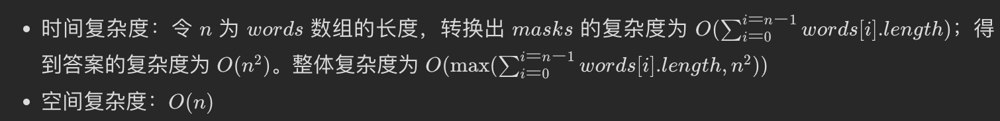

:::success Tips
题目类型: 位运算
:::

## 题目

给你一个字符串数组 words, 找出并返回 `length(words[i]) * length(words[j])` 的最大值, 并且这两个单词不含有公共字母. 如果不存在这样的两个单词, 返回 0.

:::info 示例

```ts
输入: words = ["abcw", "baz", "foo", "bar",  "xtfn","abcdef"]
输出: 16
解释: 这两个单词为 "abcw", "xtfn".
```

```ts
输入: words = ["a", "ab", "abc", "d", "cd", "bcd", "abcd"]
输出: 4
解释: 这两个单词为 "ab", "cd".
```

```ts
输入: words = ["a" ,"aa", "aaa", "aaaa"]
输出: 0
解释: 不存在这样的两个单词.
```

:::

## 题解

import Tabs from '@theme/Tabs'
import TabItem from '@theme/TabItem'

<Tabs>
  <TabItem value="朴素解法" label="朴素解法">

就不拿出来丢人现眼了...

```ts
/**
 * @param {string[]} words
 * @return {number}
 */
var maxProduct = function (words) {
  let max = 0

  for (let i = 0; i < words.length; i++) {
    const wordA = words[i]

    for (let j = i + 1; j < words.length; j++) {
      const wordB = words[j]

      if (!hasCommonLeter(wordA, wordB)) {
        max = Math.max(wordA.length * wordB.length, max)
      }
    }
  }

  return max
}

/**
 * @param {string} a
 * @param {string} b
 * @return {boolean}
 */
var hasCommonLeter = function (a, b) {
  const arrA = a.split('')
  const arrB = b.split('')

  return arrA.some((letter) => arrB.includes(letter))
}
```

</TabItem>

<TabItem value="位运算" label="位运算" default>

位运算的方式说实话也没高到哪里去. 它的思路就是把字母换成二进制, 比如 a 就是 1, b 就是 10, c 就是 100...

这样的话, 我们就可以可以通过 `&` 运算符, 来对比两个单词是否有重复. 比起朴素版本, 减少了 hasCommonLeter 函数的耗时操作.

```ts
/**
 * @param {string[]} words
 * @return {number}
 */
var maxProduct = function (words) {
  let max = 0
  const bitWords = []

  for (let i = 0; i < words.length; i++) {
    let bitWord = 0

    for (const letter of words[i]) {
      // 把字符串换成二进制掩码形式
      bitWord |= 1 << (letter.charCodeAt() - 97)
    }

    bitWords[i] = bitWord
  }

  for (let i = 0; i < bitWords.length; i++) {
    for (let j = 1; j < bitWords.length; j++) {
      // 通过按位与来对比两个单词是否有重复
      if ((bitWords[i] & bitWords[j]) === 0) {
        max = Math.max(max, words[i].length * words[j].length)
      }
    }
  }

  return max
}
```

### 复杂度分析



  </TabItem>
  
  <TabItem value="位运算优化版" label="位运算优化版">

其实还可以优化, 由于 bitWord 可能存在相同的, 比如 'b' 和 'aa', 它俩的 bitWord 都是 2(二进制是 10). 因此可以使用一个 HashMap 来存储: key 就是 bitWord; value 则存储那个大的. 由于 'aa' 要比 'b' 的 length 要大, 所以存 `'aa'.length`.

这样, 下面在双循环时, 就可以省出那些相同的 bitWord 来.

```ts
var maxProduct = function (words) {
  let max = 0
  const bitWords = new Map()

  for (let i = 0; i < words.length; i++) {
    let bitWord = 0

    const word = words[i]
    const wordLen = word.length
    for (const letter of words[i]) {
      bitWord |= 1 << (letter.charCodeAt() - 97)
    }

    if (!bitWords.has(bitWord) || bitWords.get(bitWord) < wordLen) {
      bitWords.set(bitWord, wordLen)
    }
  }

  for (const bitWordA of bitWords.keys()) {
    for (const bitWordB of bitWords.keys()) {
      if ((bitWordA & bitWordB) === 0) {
        max = Math.max(max, bitWords.get(bitWordA) * bitWords.get(bitWordB))
      }
    }
  }

  return max
}
```

### 复杂度分析


  </TabItem>
</Tabs>
