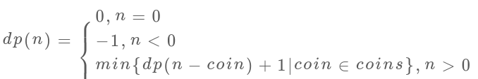

:::success Tips
题目类型: Dynamic Programming

相关题目:

- [518. 零钱兑换-ii(背包组合问题)](/leetcode/medium/518-change)

:::

## 题目

给定不同面额的硬币 `coins` 和一个总金额 `amount`. 编写一个函数来计算可以凑成总金额所需的**最少的硬币个数**. 如果没有任何一种硬币组合能组成总金额, 返回 `-1`. 你可以认为每种硬币的数量是无限的.

:::info 示例

输入: `coins = [1, 2, 5]`, `amount = 11`

输出: `3`

解释: `1 + 5 + 5 = 11`
:::

## 题解

import Tabs from '@theme/Tabs'
import TabItem from '@theme/TabItem'

<Tabs>
  <TabItem value="JavaScript - 暴力递归" label="JavaScript - 暴力递归">

这个方法提交会报超时, 所以看看就好. 下面是状态转移方程, 显然当目标 `amount` 为 `0` 时, 所需的硬币数也为 `0`; 当目标 `amount` 小于 `0` 时, 意味着根本凑不齐, 即无解, 返回 `-1`.

子问题总数为递归树节点个数, 是 O(n<sup>k</sup>). 每个子问题中含有一个 `for` 循环, 复杂度为` O(k)`. 所以总时间复杂度为 O(k \* n<sup>k</sup>), 指数级别.




```ts
/**
 * @param {number[]} coins
 * @param {number} amount
 * @return {number}
 */
var coinChange = function (coins, amount) {
  const dp = (n) => {
    if (n === 0) return 0
    if (n < 0) return -1
    let res = Number.MAX_SAFE_INTEGER
    for (const coin of coins) {
      const subproblem = dp(n - coin)
      // 子问题无解, 跳过
      if (subproblem === -1) continue
      res = Math.min(res, 1 + subproblem)
    }

    return res === Number.MAX_SAFE_INTEGER ? -1 : res
  }

  return dp(amount)
}
```

</TabItem>
<TabItem value="JavaScript - 暴力递归 + 备忘录" label="JavaScript - 暴力递归 + 备忘录">

### 暴力递归 + 备忘录

这个方法勉强能 `AC` 了, 即将 `n` 存到 `memo`, 避免重复计算, 此时的时间复杂度为 `O(k * n)`.

```ts
var coinChange = function (coins, amount) {
  const memo = {}
  const dp = (n) => {
    // 先查找备忘录
    if (n in memo) return memo[n]

    if (n === 0) return 0
    if (n < 0) return -1
    let res = Number.MAX_SAFE_INTEGER
    for (const coin of coins) {
      const subproblem = dp(n - coin)
      // 子问题无解, 跳过
      if (subproblem === -1) continue
      res = Math.min(res, 1 + subproblem)
    }

    memo[n] = res === Number.MAX_SAFE_INTEGER ? -1 : res
    return memo[n]
  }

  return dp(amount)
}
```

</TabItem>
<TabItem value="JavaScript - 动态规划" label="JavaScript - 动态规划" default>

DP 就是"自底而上"的解法了, **`dp[i] = x` 表示: 当目标金额为 `i` 时, 至少需要 `x` 枚硬币**.
值得注意的是, 题解将 `dp` 的每个元素初始化成 `amount + 1`, 这是因为硬币最小的面额是 `1`,
因此结果最多也就是需要 `amount` 个硬币, 因此可以使用 `amount + 1` 来代替 `Number.MAX_SAFE_INTEGER`, 此时的时间复杂度为 `O(k * n)`.


```ts
var coinChange = function (coins, amount) {
  const n = amount + 1
  const dp = new Array(n).fill(n)
  dp[0] = 0

  for (const coin of coins) {
    for (let i = coin; i < n; i++) {
      dp[i] = Math.min(dp[i], dp[i - coin] + 1)
    }
  }

  return dp[amount] === n ? -1 : dp[amount]
}
```

<TabItem value="Rust" label="Rust">

```rust

```

</TabItem>

</TabItem>
</Tabs>
