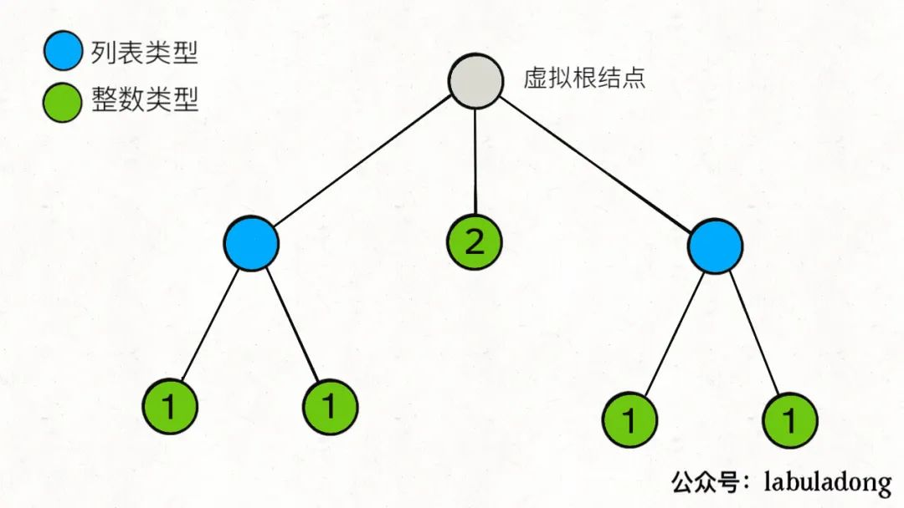

## 题目

给你一个嵌套的整型列表. 请你设计一个迭代器, 使其能够遍历这个整型列表中的所有整数. 列表中的每一项或者为一个整数, 或者是另一个列表. 其中列表的元素也可能是整数或是其他列表.

:::info 示例

输入: [[1,1],2,[1,1]]

输出: [1,1,2,1,1]

解释: 通过重复调用 next 直到 hasNext 返回 false, next 返回的元素的顺序应该是: [1,1,2,1,1]
:::

## 题解



### 方法一: 递归

由上图可以看出, 嵌套的整型列表是一个多叉树结构, **树上的叶子节点对应一个整数, 非叶节点对应一个列表**. 在这棵树上深度优先搜索的顺序就是迭代器遍历的顺序. 我们可以使用递归实现.

```ts
/**
 * // This is the interface that allows for creating nested lists.
 * // You should not implement it, or speculate about its implementation
 * function NestedInteger() {
 *
 *     Return true if this NestedInteger holds a single integer, rather than a nested list.
 *     @return {boolean}
 *     this.isInteger = function() {
 *         ...
 *     };
 *
 *     Return the single integer that this NestedInteger holds, if it holds a single integer
 *     Return null if this NestedInteger holds a nested list
 *     @return {integer}
 *     this.getInteger = function() {
 *         ...
 *     };
 *
 *     Return the nested list that this NestedInteger holds, if it holds a nested list
 *     Return null if this NestedInteger holds a single integer
 *     @return {NestedInteger[]}
 *     this.getList = function() {
 *         ...
 *     };
 * };
 */
/**
 * @constructor
 * @param {NestedInteger[]} nestedList
 */
var NestedIterator = function (nestedList) {
  vals = []
  const dfs = (nestedList) => {
    for (const nest of nestedList) {
      if (nest.isInteger()) {
        vals.push(nest.getInteger())
      } else {
        dfs(nest.getList())
      }
    }
  }
  dfs(nestedList)
}

/**
 * @this NestedIterator
 * @returns {boolean}
 */
NestedIterator.prototype.hasNext = function () {
  return vals.length > 0
}

/**
 * @this NestedIterator
 * @returns {integer}
 */
NestedIterator.prototype.next = function () {
  const val = vals[0]
  vals.shift()
  return val
}

/**
 * Your NestedIterator will be called like this:
 * var i = new NestedIterator(nestedList), a = [];
 * while (i.hasNext()) a.push(i.next());
 */
```

时间复杂度: 初始化为 O(n), next 和 hasNext 方法为 O(1).其中 n 是嵌套的整型列表中的元素个数.

空间复杂度: O(n), 需要一个数组存储嵌套的整型列表中的所有元素.

### 方法二: 栈

因为递归可以用栈来代替. 具体来说, 用一个栈来维护深度优先搜索时, 从根节点到当前节点路径上的所有节点. 由于非叶节点对应的是一个列表, 我们在栈中存储的是指向列表当前遍历的元素的指针. 每次向下搜索时, 取出列表的当前指针指向的元素并将其入栈, 同时将该指针向后移动一位. 如此反复直到找到一个整数. 循环时若栈顶指针指向了列表末尾, 则将其从栈顶弹出.

```ts
var NestedIterator = function (nestedList) {
  this.stack = nestedList
}

NestedIterator.prototype.hasNext = function () {
  while (this.stack.length !== 0) {
    // 如果栈顶是数字, 则返回 true
    if (this.stack[0].isInteger()) {
      return true
    } else {
      // 如果栈顶是列表
      let cur = this.stack[0].getList()
      // 将该列表去掉
      this.stack.shift()
      // 将该列表中的元素打平, 全都放到栈顶
      this.stack.unshift(...cur)
    }
  }

  return false
}

NestedIterator.prototype.next = function () {
  return this.stack.shift().getInteger()
}
```
