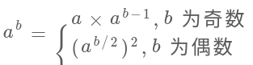

## 题目

你的任务是计算 `a^b` 对 `1337` 取模，a 是一个正整数，b 是一个非常大的正整数且会以数组形式给出.

:::info 示例

输入: a = 2147483647, b = [2,0,0]

输出: 1198

解释: 其实就是求 `2147483647^200 % 1337`
:::

## 题解

这道题的难点有二:

1. 如何处理用数组表示的指数
2. 如何取模运算, 直接计算 `2147483647^200 % 1337` 是不现实的, 肯定溢出

### 处理数组指数

- a<sup>[8, 9, 6, 4]</sup>
- => a<sup>4</sup> × a<sup>[8, 9, 6, 0]</sup>
- => a<sup>4</sup> × (a<sup>[8, 9, 6]</sup>)<sup>10</sup>

```ts
    superPow(a, [8, 9, 6, 4])
=>  superPow(a, [8, 9, 6])
```

通过上面公式, 其实这就是一个递归的结构, 因为问题规模在不断缩小.

```ts
var superPow = function (a, b) {
  if (b.length <= 0) return 1

  const last = b.pop()
  const left = Math.pow(a, last)
  const right = Math.pow(superPow(a, b), 10)

  return left * right
}
```

### 计算幂运算

上面的代码中, 显然直接用 `Math.pow()` 得出事, 因此我们得手动写一个求幂的方法.

:::info 取模公式
`(a * b) % k = (a % k) * (b % k) % k`

证明:

设 `a = A * k + B, b = C * k + D` (其中 A, B, C, D 是任意常数)

那么:

`a * b = A * C * k^2 + A * D * k + B * C * k + B * D`

`a * b % k = B * D % k`

又因为:

`a % k = B, b % k = D`

所以:

`(a % k) * (b % k) % k = B * D % k`
:::

因此我们自己实现一个 `Math.pow()`:

```ts
const BASE = 1337

var superPow = function (a, b) {
  if (b.length <= 0) return 1

  const last = b.pop()
  const left = customPow(a, last)
  const right = customPow(superPow(a, b), 10)

  // 每次乘法都要求模
  return (left * right) % BASE
}

// 计算 a 的 k 次方然后与 BASE 求模的结果
var customPow = function (a, k) {
  // 对因子求模
  a %= BASE
  let res = 1
  for (let i = 0; i < k; i++) {
    // 这里有乘法, 是潜在的溢出点
    res *= a
    // 对乘法结果求模
    res %= BASE
  }
  return res
}
```

## 高效求幂



```ts
var customPow = function (a, k) {
  if (k === 0) return 1
  a %= BASE

  if (k % 2 === 1) {
    // k 是奇数
    return (a * customPow(a, k - 1)) % BASE
  } else {
    // k 是偶数
    let sub = customPow(a, k / 2)
    return (sub * sub) % BASE
  }
}
```
