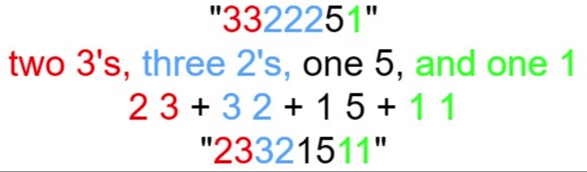

## 题目

给定一个正整数 `n`, 输出外观数列的第 `n` 项.

**外观数列**是一个整数序列, 从数字 `1` 开始, 序列中的每一项都是对前一项的描述.

你可以将其视作是由递归公式定义的数字字符串序列:

- `countAndSay(1) = "1"`
- `countAndSay(n)` 是对 `countAndSay(n - 1)` 的描述, 然后转换成另一个数字字符串.

前五项如下:

```ts
1.     1
2.     11
3.     21
4.     1211
5.     111221
第一项是数字 1
描述前一项, 这个数是 1 即 "一 个 1 ", 记作 "11"
描述前一项, 这个数是 11 即 "二 个 1 " , 记作 "21"
描述前一项, 这个数是 21 即 "一 个 2 + 一 个 1 " , 记作 "1211"
描述前一项, 这个数是 1211 即 "一 个 1 + 一 个 2 + 二 个 1 " , 记作 "111221"
```

要**描述**一个数字字符串, 首先要将字符串分割为**最小**数量的组, 每个组都由连续的最多**相同字符**组成.
然后对于每个组, 先描述字符的数量, 然后描述字符, 形成一个描述组. 要将描述转换为数字字符串, 先将每组中的字符数量用数字替换, 再将所有描述组连接起来.

例如, 数字字符串 `"3322251"` 的描述如下图:



提示:

- `1 <= n <= 30`

:::info 示例

```ts
输入: n = 1
输出: "1"
解释: 这是一个基本样例.
```

```ts
输入: n = 4
输出: "1211"
解释:
countAndSay(1) = "1"
countAndSay(2) = 读 "1" = 一 个 1 = "11"
countAndSay(3) = 读 "11" = 二 个 1 = "21"
countAndSay(4) = 读 "21" = 一 个 2 + 一 个 1 = "12" + "11" = "1211"
```

:::

## 题解

import Tabs from '@theme/Tabs'
import TabItem from '@theme/TabItem'

<Tabs>
  <TabItem value="JavaScript - 我的解法" label="JavaScript - 我的解法" default>

虽然没有 ChatGPT 写的好看, 但是, 又不是不能用.jpg

```ts
/**
 * @param {number} n
 * @return {string}
 */
var countAndSay = function (n) {
  let res = '1'

  // 第一个就是 '1', 因此从第二个开始运算
  while (n - 1 > 0) {
    // 当前指向的数字
    let curr = 1

    // 当前指向的数字的个数
    let count = 0

    // 做完一轮转化后的字符串, 用于最终更新 res
    let say = ''

    // 从后往前遍历
    for (let i = res.length - 1; i >= 0; i--) {
      const num = Number(res[i])

      // 如果数字和 curr 相同, 让 count++
      if (num === curr) {
        count++
      } else {
        // 如果不同, 就要收割了, 比如计算到有 3 个 1, 那就把 31 存到 say 中
        say = `${count}${curr}` + say

        // 并把新的数字赋值给 curr
        curr = num

        // 由于新数字在这里已经被遍历到一次, 故让 count 为 1
        count = 1
      }
    }

    // 由于上面循环在退出后, 最后一个数字的外观数列没存起来, 因此需要在执行一次
    say = `${count}${curr}` + say

    // 最终用 say 替换 res, 以备下次计算
    res = say

    // 最后记得 n--
    n--
  }

  return res
}
```

</TabItem>
<TabItem value="JavaScript - ChatGPT 写的" label="JavaScript - ChatGPT 写的">

虽然没有 ChatGPT 写的好看, 但是, 又不是不能用.jpg

```ts
/**
 * @param {number} n
 * @return {string}
 */
var countAndSay = function (n) {
  let result = '1'

  for (let i = 1; i < n; i++) {
    let count = 1
    let say = ''

    for (let j = 1; j < result.length; j++) {
      if (result[j] === result[j - 1]) {
        count++
      } else {
        say += count + result[j - 1]
        count = 1
      }
    }

    say += count + result[result.length - 1]
    result = say
  }

  return result
}
```

</TabItem>
<TabItem value="Rust" label="Rust">

```rust
pub fn count_and_say(n: i32) -> String {
    let mut n = n;
    let mut res = String::from("1");

    while n - 1 > 0 {
        let mut curr = '1';
        let mut count = 0;
        let mut say = String::from("");

        for ch in res.chars().rev() {
            if ch == curr {
                count += 1;
            } else {
                say = format!("{}{}{}", count, curr, say);
                curr = ch;
                count = 1;
            }
        }

        say = format!("{}{}{}", count, curr, say);
        res = say;
        n -= 1;
    }

    res
}
```

</TabItem>
</Tabs>
