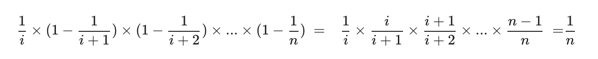

:::success Tips
题目类型: 水塘抽样算法(蓄水池抽样算法)

相关题目:

- [398. 随机数索引](/leetcode/medium/398-solution)

:::

## 题目

给定一个单链表, 随机选择链表的一个节点, 并返回相应的节点值. 保证每个节点被选的概率一样. 进阶: 如果链表十分大且长度未知, 如何解决这个问题? 你能否使用常数级空间复杂度实现?

:::info 示例

```ts
// 初始化一个单链表 [1,2,3].
const head = new ListNode(1)
head.next = new ListNode(2)
head.next.next = new ListNode(3)
const solution = new Solution(head)

// getRandom()方法应随机返回 1,2,3 中的一个, 保证每个元素被返回的概率相等.
solution.getRandom()
```

:::

## 题解

水塘抽样算法(蓄水池采样算法, Reservoir Sampling), 是说在一个流中, 随机选择 k 个数字, 保证每个数字被选择的概率相等.

先说结论, 当你遇到第 `i` 个元素时, 应该有 `1 / i` 的概率选择该元素, `1 - 1 / i` 的概率保持原有的选择.
证明: 假设总共有 `n` 个元素, 我们要的随机性无非就是每个元素被选择的概率都是 `1 / n` 对吧, 那么对于第 `i` 个元素, 它被选择的概率就是:



第 `i` 个元素被选择的概率是 `1 / i`, 第 `i + 1` 次不被替换的概率是 `1 - 1 / (i + 1)`, 以此类推, 相乘就是第 `i` 个元素最终被选中的概率, 就是 `1 / n`.

```ts
/**
 * Definition for singly-linked list.
 * function ListNode(val, next) {
 *     this.val = (val===undefined ? 0 : val)
 *     this.next = (next===undefined ? null : next)
 * }
 */
/**
 * @param head The linked list's head.
        Note that the head is guaranteed to be not null, so it contains at least one node.
 * @param {ListNode} head
 */
var Solution = function (head) {
  this.head = head
}

/**
 * Returns a random node's value.
 * @return {number}
 */
Solution.prototype.getRandom = function () {
  let cnt = 0
  let res = 0
  let head = this.head
  while (head) {
    ++cnt
    if (Math.floor(Math.random() * cnt) === 0) {
      res = head.val
    }
    head = head.next
  }
  return res
}

/**
 * Your Solution object will be instantiated and called as such:
 * var obj = new Solution(head)
 * var param_1 = obj.getRandom()
 */
```
