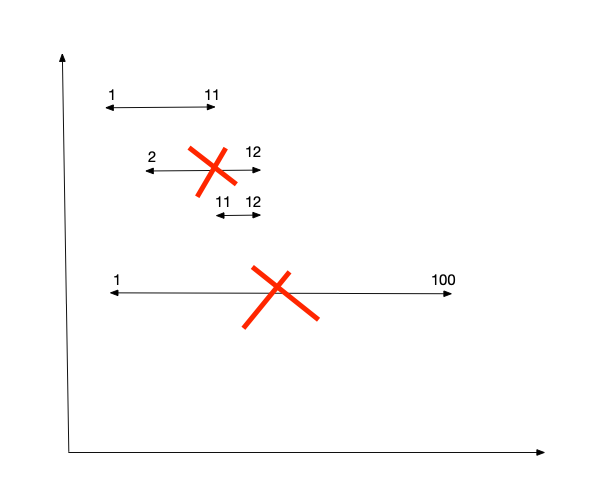

:::success Tips
题目类型: Greedy

相关题目:

- [45. 跳跃游戏-ii](/leetcode/medium/45-jump)
- [55. 跳跃游戏](/leetcode/medium/55-can-jump)
- [452. 用最少数量的箭引爆气球](/leetcode/medium/452-find-min-arrow-shots)

:::

## 题目

给定一个区间的集合, 找到需要移除区间的最小数量, 使剩余区间互不重叠.

注意:

- 可以认为区间的终点总是大于它的起点.
- 区间 [1,2] 和 [2,3] 的边界相互"接触", 但没有相互重叠.

:::info 示例

```ts
输入: [ [1,2], [2,3], [3,4], [1,3] ]
输出: 1
解释: 移除 [1,3] 后, 剩下的区间没有重叠.
```

```ts
输入: [ [1,2], [1,2], [1,2] ]
输出: 2
解释: 你需要移除两个 [1,2] 来使剩下的区间没有重叠.
```

```ts
输入: [ [1,2], [2,3] ]
输出: 0
解释: 你不需要移除任何区间, 因为它们已经是无重叠的了.
```

:::

## 题解

1. 在所有区间中选择 end 最小的那个区间, 因此先排个序

2. 如果某个区间 x 的 start 小于 smallestEnd, 说明这个区间 x 是重叠的

3. 否则把这个区间 x 的 end 设为新的 smallestEnd



```ts
/**
 * @param {number[][]} intervals
 * @return {number}
 */
var eraseOverlapIntervals = function (intervals) {
  const n = intervals.length
  // 根据 end 从小到大排序
  intervals.sort((a, b) => a[1] - b[1])

  let total = 0
  // 选取最小的 end
  let smallestEnd = intervals[0][1]

  for (let i = 1; i < n; i++) {
    const [start, end] = intervals[i]

    if (start < smallestEnd) {
      total++
    } else {
      smallestEnd = end
    }
  }

  return total
}
```
