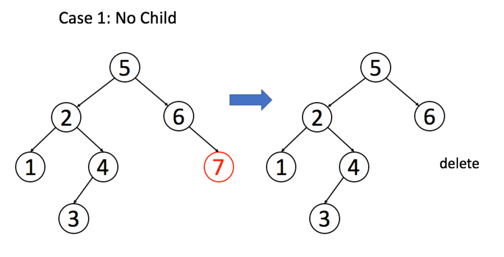
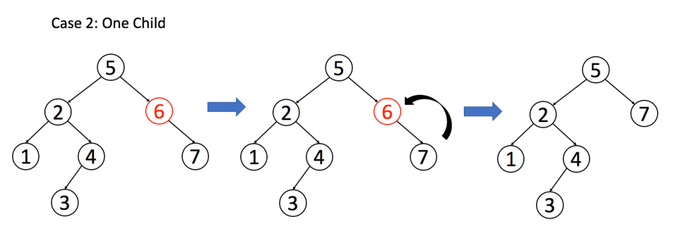
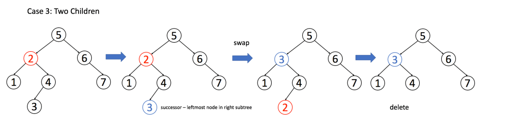

:::success Tips
题目类型: Tree, BST

相关题目: [98. 验证二叉搜索树](/leetcode/medium/98-is-valid-bst), [700. 二叉搜索树中的搜索](/leetcode/easy/700-search-bst), [701. 二叉搜索树中的插入操作](/leetcode/medium/701-insert-into-bst)
:::

## 题目

给定一个二叉搜索树的根节点 root 和一个值 key, 删除二叉搜索树中的 key 对应的节点, 并保证二叉搜索树的性质不变.返回二叉搜索树(有可能被更新)的根节点的引用.

:::info 示例

输入: root = 如下, key = 3

```ts
    5
   / \
  3   6
 / \   \
2   4   7
```

输出: 下面两种任意一种都行.

```ts
    5
   / \
  4   6
 /     \
2       7


  5
 / \
2   6
 \   \
  4   7
```

:::

## 题解

删除节点可分为两个步骤:

1. 首先找到需要删除的节点;
2. 如果找到了, 删除它.

```ts
var deleteNode = function (root: TreeNode, key: number) {
  if (root.val == key) {
    // 找到了该节点, 进行删除
    // ...
  } else if (root.val > key) {
    // 去左子树找
    root.left = deleteNode(root.left, key)
  } else if (root.val < key) {
    // 去右子树找
    root.right = deleteNode(root.right, key)
  }
  return root
}
```

上面就是查找到这个元素的方法了, 接下来就需要做删除操作. 删除会遇到三种情况: 第一种是正好该节点为叶子结点, 那就直接把它删了就行了, 对应的代码如下.

```ts
if (root.left === null && root.right === null) return null
```



第二种是该节点只有一个非空子节点, 那么它要让这个孩子接替自己的位置即可, 对应代码如下. 其实这两种情况都可以用下面的代码搞定, 因为对于**正好该节点为叶子结点**情况, 就直接能返回 null 了.

```ts
if (root.left === null) return root.right
if (root.right === null) return root.left
```



第三种就比较复杂, 就是该节点有两个非空节点, 那么我们需要找到该节点**左子树中最大的那个节点, 或者右子树中最小的那个节点来接替自己**

以后者为例, 因为要删除节点 2, 那么先找到节点 2 右子树最小的, 是节点 3; 然后把 3 赋值给当前节点. 此时因为 minNode 还存在, 所以转而去删除 minNode 即可.

```ts
if (root.left !== null && root.right !== null) {
  // 找到右子树的最小节点
  const minNode = getMin(root.right)
  // 把 root 改成 minNode
  root.val = minNode.val
  // 转而去删除 minNode
  root.right = deleteNode(root.right, minNode.val)
}
```



```ts
/**
 * Definition for a binary tree node.
 * function TreeNode(val, left, right) {
 *     this.val = (val===undefined ? 0 : val)
 *     this.left = (left===undefined ? null : left)
 *     this.right = (right===undefined ? null : right)
 * }
 */
/**
 * @param {TreeNode} root
 * @param {number} key
 * @return {TreeNode}
 */
var deleteNode = function (root, key) {
  if (root === null) return null
  if (root.val === key) {
    // 这两个 if 把情况 1 和 2 都正确处理了
    if (root.left === null) return root.right
    if (root.right === null) return root.left
    // 处理情况 3
    const minNode = getMin(root.right)
    root.val = minNode.val
    root.right = deleteNode(root.right, minNode.val)
  } else if (root.val > key) {
    root.left = deleteNode(root.left, key)
  } else if (root.val < key) {
    root.right = deleteNode(root.right, key)
  }
  return root
}

var getMin = function (root) {
  // BST 最左边的就是最小的
  while (root.left !== null) root = root.left
  return root
}
```
