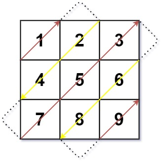

## Problem

Given an `m x n` matrix `mat`, return an array of all the elements of the array in a **diagonal order**.

:::note Constraints:

- `m == mat.length`
- `n == mat[i].length`
- `1 <= m, n <= 10^4`
- `1 <= m * n <= 10^4`
- `-10^5 <= mat[i][j] <= 10^5`

:::

:::info Examples

**Example 1:**



```bash
Input: mat = [[1,2,3],[4,5,6],[7,8,9]]
Output: [1,2,4,7,5,3,6,8,9]
```

**Example 2:**

```bash
Input: mat = [[1,2],[3,4]]
Output: [1,2,3,4]
```

:::

## Solution

The key to this problem is understanding the diagonal traversal pattern:
- We traverse diagonals in a zig-zag manner
- Odd diagonals (0-indexed) go from bottom-left to top-right (upward)
- Even diagonals go from top-left to bottom-right (downward)

The approach:
1. Each diagonal can be identified by the sum of its row and column indices (`i + j`)
2. For diagonal `d`, when going upward, we start from the bottom-left and move to top-right
3. When going downward, we start from the top-left and move to bottom-right
4. We use direction flag to alternate between upward and downward traversals

Alternative approach using simulation:
1. Start at position `(0, 0)` going upward
2. When hitting boundaries, change direction and adjust position accordingly
3. Continue until all elements are visited

import Tabs from '@theme/Tabs'
import TabItem from '@theme/TabItem'

<Tabs>
  <TabItem value="JavaScript" label="JavaScript" default>

```ts
/**
 * @param {number[][]} mat
 * @return {number[]}
 */
var findDiagonalOrder = function (mat) {
  const m = mat.length
  const n = mat[0].length
  const result = []

  let row = 0
  let col = 0
  let direction = 1 // 1 for up, -1 for down

  for (let i = 0; i < m * n; i++) {
    result.push(mat[row][col])

    if (direction === 1) {
      // Going up
      if (col === n - 1) {
        // Hit right boundary
        row++
        direction = -1
      } else if (row === 0) {
        // Hit top boundary
        col++
        direction = -1
      } else {
        // Continue going up
        row--
        col++
      }
    } else {
      // Going down
      if (row === m - 1) {
        // Hit bottom boundary
        col++
        direction = 1
      } else if (col === 0) {
        // Hit left boundary
        row++
        direction = 1
      } else {
        // Continue going down
        row++
        col--
      }
    }
  }

  return result
}
```

</TabItem>
<TabItem value="Rust" label="Rust">

```rust
pub fn find_diagonal_order(mat: Vec<Vec<i32>>) -> Vec<i32> {
    if mat.is_empty() || mat[0].is_empty() {
        return vec![];
    }

    let m = mat.len();
    let n = mat[0].len();
    let mut result = Vec::with_capacity(m * n);

    let mut row = 0;
    let mut col = 0;
    let mut direction = 1; // 1 for up, -1 for down

    for _ in 0..m * n {
        result.push(mat[row][col]);

        if direction == 1 {
            // Going up
            if col == n - 1 {
                // Hit right boundary
                row += 1;
                direction = -1;
            } else if row == 0 {
                // Hit top boundary
                col += 1;
                direction = -1;
            } else {
                // Continue going up
                row -= 1;
                col += 1;
            }
        } else {
            // Going down
            if row == m - 1 {
                // Hit bottom boundary
                col += 1;
                direction = 1;
            } else if col == 0 {
                // Hit left boundary
                row += 1;
                direction = 1;
            } else {
                // Continue going down
                row += 1;
                col -= 1;
            }
        }
    }

    result
}
```

</TabItem>
</Tabs>

## Complexity Analysis

- **Time Complexity**: `O(m * n)` - We visit each element in the matrix exactly once.
- **Space Complexity**: `O(1)` - Excluding the output array, we only use constant extra space for variables (row, col, direction).
