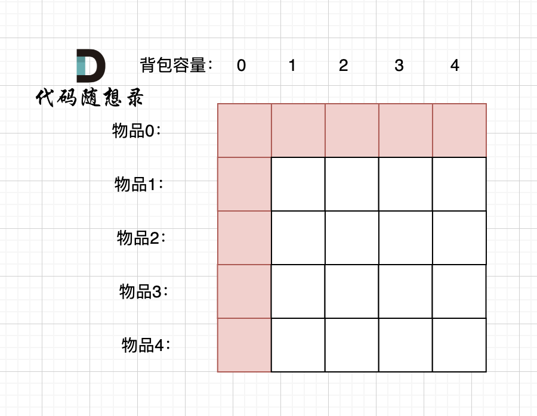

:::success Tips
题目类型: Dynamic Programming

相关题目:

- [322. 零钱兑换(完全背包问题)](/leetcode/medium/322-coin-change)

:::

## 题目

给定不同面额的硬币和一个总金额. 写出函数来计算可以凑成总金额的硬币组合数. 假设每一种面额的硬币有无限个.

:::info 示例

输入: `amount = 5`, `coins = [1, 2, 5]`

输出: `4`

解释: 有四种方式可以凑成总金额:

- `5 = 5`
- `5 = 2 + 2 + 1`
- `5 = 2 + 1 + 1 + 1`
- `5 = 1 + 1 + 1 + 1 + 1`

:::

## 题解

import Tabs from '@theme/Tabs'
import TabItem from '@theme/TabItem'

<Tabs>
  <TabItem value="JavaScript - 二维数组" label="JavaScript - 二维数组">



```ts
/**
 * @param {number} amount
 * @param {number[]} coins
 * @return {number}
 */
var change = function (amount, coins) {
  const n = coins.length
  const dp = new Array(n + 1).fill(0).map(() => new Array(amount + 1).fill(0))

  dp[0][0] = 1
  for (let i = 1; i <= n; i++) {
    dp[i][0] = 1
  }

  for (let i = 1; i <= n; i++) {
    for (let w = 0; w <= amount; w++) {
      if (w - coins[i - 1] < 0) {
        dp[i][w] = dp[i - 1][w]
      } else {
        dp[i][w] = dp[i - 1][w] + dp[i][w - coins[i - 1]]
      }
    }
  }

  return dp[n][amount]
}
```

</TabItem>
  <TabItem value="JavaScript - 一维数组" label="JavaScript - 一维数组" default>

`dp[i]` 代表装满容量为 `i` 的背包有几种硬币组合, 转移方程为 `dp[i] = dp[i] + dp[i - coin]`, 也就是当前填满 `i` 容量的方法数等于之前填满 `i` 容量的硬币组合数加上填满 `i - coin` 容量的硬币组合数.

```ts
/**
 * @param {number} amount
 * @param {number[]} coins
 * @return {number}
 */
var change = function (amount, coins) {
  const n = coins.length
  const dp = new Array(amount + 1).fill(0)
  dp[0] = 1

  for (let i = 0; i < n; i++) {
    for (let w = coins[i]; w <= amount; w++) {
      dp[w] += dp[w - coins[i]]
    }
  }
  return dp[amount]
}
```

</TabItem>
<TabItem value="Rust" label="Rust">

```rust
pub fn change(amount: i32, coins: Vec<i32>) -> i32 {
    let n = coins.len();
    let mut dp = vec![0; amount as usize + 1];
    dp[0] = 1;

    for i in 0..n {
        for w in (coins[i] as usize)..=(amount as usize) {
            dp[w] += dp[w - coins[i] as usize];
        }
    }

    dp[amount as usize]
}
```

</TabItem>
</Tabs>
