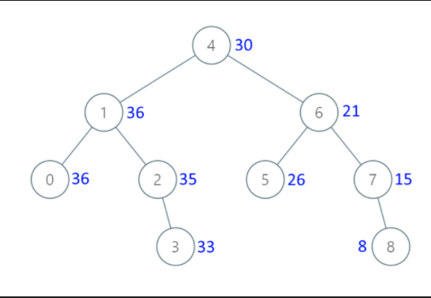

## 题目

给出**二叉搜索树**的根节点, 该树的节点值各不相同, 请你将其转换为累加树(Greater Sum Tree), 使每个节点 node 的新值等于原树中大于或等于 node.val 的值之和. 下面这个例子中, 蓝色的代表累加之后新的树.



## 题解

### 我写了个最愚蠢的解法, 谢谢大家

```ts
/**
 * Definition for a binary tree node.
 * function TreeNode(val, left, right) {
 *     this.val = (val===undefined ? 0 : val)
 *     this.left = (left===undefined ? null : left)
 *     this.right = (right===undefined ? null : right)
 * }
 */
/**
 * @param {TreeNode} root
 * @return {TreeNode}
 */
let index = 0
const arr = []

var convertBST = function (root) {
  inOrderTraverseNode(root)
  inOrderTraverseNode2(root)
  return root
}

var inOrderTraverseNode = function (root) {
  if (root === null) return null
  inOrderTraverseNode(root.left)
  arr.push(root.val)
  inOrderTraverseNode(root.right)
}

var inOrderTraverseNode2 = function (root) {
  if (root === null) return null
  inOrderTraverseNode2(root.left)
  root.val = getVal()
  index++
  inOrderTraverseNode2(root.right)
}

var getVal = function () {
  return arr.slice(index).reduce((acc, val) => acc + val)
}
```

### 优雅解法

Emmmm, 我真是个垃圾. BST 的中序遍历, 如果先左再右, 顺序是升序的; 如果先右再左, 顺序是降序的. 看上面这个示例, 使用降序遍历, 遍历出来的是 8 7 6 5 4 3 2 1 0.

因此先访问 8, 此时它的累加树的值也是 8; 接下来访问 7, 此时它的累加树的值是 8 + 7 = 15; 接下来访问 6, 此时它的累加树的值是 8 + 7 + 6 = 21...

这就好办了, 我们可以维护一个变量 sum, `sum += root.val`, 那么遇见哪个节点, 就把 sum 赋值给它即可.

```ts
var convertBST = function (root) {
  let sum = 0

  var inOrderTraverseNode = function (root) {
    if (root === null) return null
    inOrderTraverseNode(root.right)
    sum += root.val
    root.val = sum
    inOrderTraverseNode(root.left)
  }

  inOrderTraverseNode(root)

  return root
}
```
