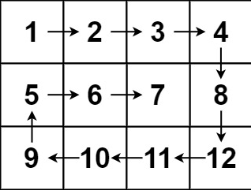

## 题目

给你一个 `m` 行 `n` 列的矩阵 `matrix`, 请按照**顺时针螺旋顺序**, 返回矩阵中的所有元素.

:::note 提示:

- `m == matrix.length`
- `n == matrix[i].length`
- `1 <= m, n <= 10`
- `-100 <= matrix[i][j] <= 100`

:::

:::info 示例



输入: `matrix = [[1, 2, 3, 4], [5, 6, 7, 8], [9, 10, 11, 12]]`

输出: `[1, 2, 3, 4, 8, 12, 11, 10, 9, 5, 6, 7]`
:::

## 题解

import Tabs from '@theme/Tabs'
import TabItem from '@theme/TabItem'

<Tabs>
  <TabItem value="JavaScript" label="JavaScript" default>

```ts
/**
 * @param {number[][]} matrix
 * @return {number[]}
 */
var spiralOrder = function (matrix) {
  const res = []
  let top = 0,
    right = matrix[0].length - 1,
    bottom = matrix.length - 1,
    left = 0

  while (top <= bottom && left <= right) {
    for (let i = left; i <= right; i++) res.push(matrix[top][i])
    top++

    for (let i = top; i <= bottom; i++) res.push(matrix[i][right])
    right--

    if (top > bottom || left > right) break

    for (let i = right; i >= left; i--) res.push(matrix[bottom][i])
    bottom--

    for (let i = bottom; i >= top; i--) res.push(matrix[i][left])
    left++
  }

  return res
}
```

</TabItem>
<TabItem value="Rust" label="Rust">

```rust
pub fn spiral_order(matrix: Vec<Vec<i32>>) -> Vec<i32> {
    let (mut top, mut right, mut bottom, mut left) = (0, matrix[0].len() - 1, matrix.len() - 1, 0);
    let mut res = vec![];

    while left <= right && top <= bottom {
        for i in left..=right {
            res.push(matrix[top][i]);
        }
        top += 1;

        for i in top..=bottom {
            res.push(matrix[i][right]);
        }

        // Rust 要时刻小心 usize 类型被减到负值
        if right == 0 {
            break;
        }
        right -= 1;

        if left > right || top > bottom {
            break;
        }

        for i in (left..=right).rev() {
            res.push(matrix[bottom][i]);
        }

        // Rust 要时刻小心 usize 类型被减到负值
        if bottom == 0 {
            break;
        }
        bottom -= 1;

        for i in (top..=bottom).rev() {
            res.push(matrix[i][left]);
        }
        left += 1;
    }

    res

}
```

:::success Tips
`usize` 作为索引的数据类型, 经常需要自减操作, 一定要注意不能将 `usize` 减到负值, 否则它会自动变成 `usize::MAX`, 这个数必然会造成你的数组越界.

```rust
if usize_val > 0 {
    usize_val -= 1;
}
```

:::

</TabItem>
</Tabs>
