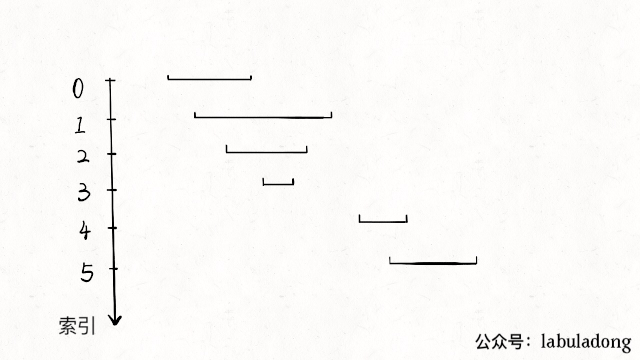

## 题目

以数组 intervals 表示若干个区间的集合, 其中单个区间为 intervals[i] = [start<sub>i</sub>, end<sub>i</sub>] . 请你合并所有重叠的区间, 并返回一个不重叠的区间数组, 该数组需恰好覆盖输入中的所有区间.

:::info 示例

```bash
输入: intervals = [[1, 3],  [2, 6],  [8, 10],  [15, 18]]
输出: [[1, 6], [8, 10], [15, 18]]
解释: 区间 [1, 3] 和 [2, 6] 重叠,  将它们合并为 [1, 6].
```

```bash
输入: intervals = [[1, 4], [4, 5]]
输出: [[1, 5]]
解释: 区间 [1, 4] 和 [4, 5] 可被视为重叠区间.
```

:::

## 题解



1. 先根据每个开始区间从小到大排序
2. 如果 `curr[0] <= last[1]`, 也就是说这两个区间有交集; 至于 curr 完全为 last 的子集, 还是局部重叠, 就去看下 `Math.max(last[1], curr[1])`, 如果 `last[1]` 大, 说明 `curr` 完全为 `last` 的子集, `last[1]` 还是那个 `last[1]`, 否则将 `last[1]` 更新成 curr[1]
3. 否则的话就不是连续区间, 那就直接 `push` 到 `res` 即可

```ts
1 2 3

  2 3 4 5 6

              8 9
```

import Tabs from '@theme/Tabs'
import TabItem from '@theme/TabItem'

<Tabs>
  <TabItem value="JavaScript" label="JavaScript" default>

```ts
/**
 * @param {number[][]} intervals
 * @return {number[][]}
 */
var merge = function (intervals) {
  const n = intervals.length
  const res = []
  if (n === 0) return res
  intervals.sort((a, b) => a[0] - b[0])
  res.push(intervals[0])

  for (let i = 1; i < n; i++) {
    const curr = intervals[i]
    const peek = res[res.length - 1]

    // 有重叠(或包含)
    if (curr[0] <= peek[1]) {
      peek[1] = Math.max(peek[1], curr[1])
    } else {
      res.push(curr)
    }
  }

  return res
}
```

</TabItem>
<TabItem value="Rust" label="Rust">

```rust
use std::cmp;

pub fn merge(intervals: Vec<Vec<i32>>) -> Vec<Vec<i32>> {
    let mut intervals = intervals;
    let n = intervals.len();
    let mut res: Vec<Vec<i32>> = vec![];
    if n == 0 {
        return res;
    }
    intervals.sort_by(|a, b| a[0].cmp(&b[0]));
    res.push(intervals[0].to_vec());


    for i in 1..n {
        let curr = &intervals[i];
        let mut peek = res.last_mut().unwrap();

        if curr[0] <= peek[1] {
            peek[1] = cmp::max(peek[1], curr[1]);
        } else {
            res.push(curr.to_vec());
        }
    }

    res
}

```

</TabItem>
</Tabs>
