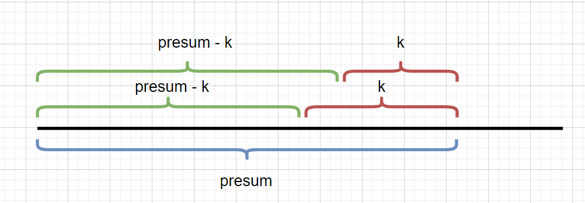

:::success Tips
题目类型: 前缀和

相关题目: 

- [523. 连续的子数组和](/leetcode/medium/523-check-subarray-sum)
- [930. 和相同的二元子数组](/leetcode/medium/930-num-subarrays-with-sum)
:::

## 题目

给定一个整数数组和一个整数 k, 你需要找到该数组中和为 k 的**连续**的子数组的个数.

:::info 示例

输入: nums = [1, 1, 1], k = 2

输出: 2

解释: [1, 1] 与 [1, 1] 为两种不同的情况.
:::

## 题解

### 暴力法 🐸

暴力法核心就是整个双循环穷尽所有子数组, 如果这个子数组的和等于 k, 那就让 count++, 直到循环完毕.

```ts
var subarraySum = function (nums, k) {
  const len = nums.length
  let count = 0

  for (let i = 0; i < len; ++i) {
    let sum = 0
    for (let j = i; j < len; ++j) {
      sum += nums[j]
      if (sum === k) count++
    }
  }

  return count
}
```

### 暴力前缀和 🐸

这道题的核心是**前缀和**, 前缀和的代码如下, 如果我们想求 nums[i] 到 nums[j] 的和, 可以使用 `preSum[j + 1] - preSum[i]` 得出.

```ts
nums = [3, 5, 2, -2, 4, 1]
preSum = [0, 3, 8, 10, 8, 12, 13]
```

```ts
var getPreSum = function (nums) {
  const len = nums.length
  const preSum = new Array(len + 1).fill(0)

  // 构造前缀和
  for (let i = 0; i < len; i++) {
    preSum[i + 1] = preSum[i] + nums[i]
  }

  return preSum
}
```

这道题可以用下面的代码解决, 但在 leetcode 提交时提示超时, 原因就是穷尽所有子数组时整了个双循环, 时间复杂度仍然是 O(n<sup>2</sup>).

```ts
/**
 * @param {number[]} nums
 * @param {number} k
 * @return {number}
 */
var subarraySum = function (nums, k) {
  const len = nums.length
  const preSum = new Array(len + 1).fill(0)

  // 构造前缀和
  for (let i = 0; i < len; i++) {
    preSum[i + 1] = preSum[i] + nums[i]
  }

  let count = 0
  // 穷举所有子数组
  for (let left = 0; left < len; left++) {
    for (let right = left; right < len; right++) {
      // 利用前缀和的性质
      if (preSum[right + 1] - preSum[left] === k) {
        count++
      }
    }
  }

  return count
}
```

### 前缀和 + HashMap

- 设 `pre[i]` 为 `pre[0..i]` 所有元素的和, 那么 `pre[i] = pre[i - 1] + nums[i]`, 因为 `pre[i]` 可以由 `pre[i - 1]` 递推过来
- 同理, **pre[j..i] 这个子数组和为 k** 这个条件可以转化为 `pre[i] - pre[j - 1] = k`
- 上面的公式也就是 `pre[j - 1] = pre[i] - k`



上面这个图就很清晰, `presum - k` 其实就是子串的和, 我们的目的是计算 `pre[i] - k` 是否等于 `presum - k`. 换句话说, 就是在总和里减去 k 是否存在, 如果存在, 那么这就是一个和为 k 的子数组. 因此我们可以通过建立一个 hash 表, 将 `pre[i] - k` 设为 key, 而这个 key **出现的次数**作为 val, 而我们最终的目的是统计 val.

import Carousel from 'nuka-carousel'
import { randomSeries } from 'yancey-js-util'
import useBaseUrl from '@docusaurus/useBaseUrl'

<Carousel
  style={{ margin: '48px 0', padding: '24px 0' }}
  renderBottomCenterControls={null}
>
  {new Array(9).fill(randomSeries(6)).map((val, index) => (
    
  ))}
</Carousel>

```ts
var subarraySum = function (nums, k) {
  // 前缀和要初始化一个 key 为 0, 因为初始化了一个 0, 所以它出现的次数就是 1
  const map = new Map([[0, 1]])

  let sum = 0
  let count = 0

  for (const num of nums) {
    sum += num
    if (map.has(sum - k)) {
      count += map.get(sum - k)
    }

    if (map.has(sum)) {
      map.set(sum, map.get(sum) + 1)
    } else {
      map.set(sum, 1)
    }
  }

  return count
}
```
