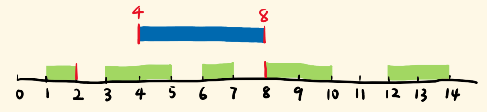

## 题目

给你一个**无重叠的**, 按照区间起始端点排序的区间列表. 在列表中插入一个新的区间, 你需要确保列表中的区间仍然有序且不重叠(如果有必要的话, 可以合并区间).

:::note 提示:

- `0 <= intervals.length <= 10⁴`
- `intervals[i].length == 2`
- `0 <= intervals[i][0] <= intervals[i][1] <= 10⁴`
- `intervals` 根据 `intervals[i][0]` 按**升序**排列
- `newInterval.length == 2`
- `0 <= newInterval[0] <= newInterval[1] <= 10⁴`

:::

:::info 示例

```ts
输入: (intervals = [
  [1, 3],
  [6, 9],
]),
  (newInterval = [2, 5])
输出: [
  [1, 5],
  [6, 9],
]
```

```ts
输入: intervals = [[1, 2], [3, 5], [6, 7], [8, 10], [12, 16]],  newInterval = [4, 8]
输出: [[1, 2], [3, 10], [12, 16]]
解释: 这是因为新的区间 [4, 8] 与 [3, 5], [6, 7], [8, 10] 重叠.
```

```ts
输入: (intervals = []), (newInterval = [5, 7])
输出: [[5, 7]]
```

```ts
输入: (intervals = [[1, 5]]), (newInterval = [2, 3])
输出: [[1, 5]]
```

```ts
输入: (intervals = [[1, 5]]), (newInterval = [2, 7])
输出: [[1, 7]]
```

:::

## 题解



朴素思路就是三段式考虑, 以上图为例:

- `intervals[i]` 完全在 `newInterval` 的左侧
- `intervals[i]` 和 `newInterval` 有交叉
- `intervals[i]` 完全在 `newInterval` 的右侧

因此我们根据三种情况, 使用一个指针 `i` 在 `intervals` 游走:

- 首先会遇到 `intervals[i][1]` 完全在 `newInterval` 的左侧, 此时只需把 `intervals[i]` 放到新数组中即可
- 接着会遇到重叠部分, 看上图, 只要 `intervals[i][0] <= newInterval[1]`, 就会发生重叠, 因此在这个条件下遍历,
  **左端取蓝绿左索引的较小者, 右端取蓝绿右索引的较大者**, 来更新 `newInterval`, 这样在循环结束后, 就得到了合并区间, 然后放到新数组中即可
- 对于剩下的部分, 自然完全是在 `newInterval` 的右侧, 逐一放到新数组中即可

import Tabs from '@theme/Tabs'
import TabItem from '@theme/TabItem'

<Tabs>
  <TabItem value="JavaScript" label="JavaScript" default>

```ts
/**
 * @param {number[][]} intervals
 * @param {number[]} newInterval
 * @return {number[][]}
 */
var insert = function (intervals, newInterval) {
  const n = intervals.length
  const result = []
  let [start, end] = newInterval

  let i = 0
  while (i < n && intervals[i][1] < start) {
    result.push(intervals[i])
    i++
  }

  while (i < n && intervals[i][0] <= end) {
    start = Math.min(intervals[i][0], start)
    end = Math.max(intervals[i][1], end)
    i++
  }
  result.push([start, end])

  result.push(...intervals.slice(i))

  return result
}
```

</TabItem>
<TabItem value="Rust" label="Rust">

```rust
use std::cmp;

pub fn insert(intervals: Vec<Vec<i32>>, new_interval: Vec<i32>) -> Vec<Vec<i32>> {
    let n = intervals.len();
    let mut new_interval = new_interval;
    let mut new_intervals = vec![];
    let mut i = 0;

    while i < n && intervals[i][1] < new_interval[0] {
        new_intervals.push(intervals[i].to_vec());
        i += 1;
    }

    while i < n && intervals[i][0] <= new_interval[1] {
        new_interval[0] = cmp::min(new_interval[0], intervals[i][0]);
        new_interval[1] = cmp::max(new_interval[1], intervals[i][1]);
        i += 1;
    }
    new_intervals.push(new_interval.to_vec());

    while i < n {
        new_intervals.push(intervals[i].to_vec());
        i += 1;
    }

    new_intervals
}
```

</TabItem>
</Tabs>
