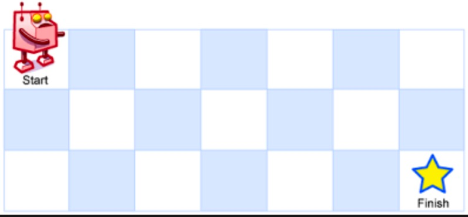

:::success Tips
题目类型: Dynamic Programming
:::

## 题目

一个机器人位于一个 `m x n` 网格的左上角(起始点在下图中标记为 Start). 机器人每次只能向下或者向右移动一步. 机器人试图达到网格的右下角(在下图中标记为 Finish). 问总共有多少条不同的路径?



:::info 示例
输入: `m = 3`, `n = 7`

输出: `28`
:::

## 题解

跟 [64. 最小路径和](/leetcode/medium/64-min-path-sum) 思路差不多, 具体看那道题. 由于每次转移只需要用到 `dp[i - 1][j]` 和 `dp[i][j - 1]`, 因此空间压缩为一维.

import Tabs from '@theme/Tabs'
import TabItem from '@theme/TabItem'

<Tabs>
  <TabItem value="JavaScript - 二维数组" label="JavaScript - 二维数组">

```ts
var uniquePaths = function (m, n) {
  const dp = new Array(m).fill(0).map(() => new Array(n).fill(0))

  for (let i = 0; i < m; i++) {
    dp[i][0] = 1
  }

  for (let j = 0; j < n; j++) {
    dp[0][j] = 1
  }

  for (let i = 1; i < m; i++) {
    for (let j = 1; j < n; j++) {
      dp[i][j] = dp[i - 1][j] + dp[i][j - 1]
    }
  }
  return dp[m - 1][n - 1]
}
```

</TabItem>
<TabItem value="JavaScript - 一维数组" label="JavaScript - 一维数组" default>

```ts
var uniquePaths = function (m, n) {
  const dp = new Array(n).fill(1)
  for (let i = 1; i < m; i++) {
    for (let j = 1; j < n; j++) {
      dp[j] = dp[j - 1] + dp[j]
    }
  }
  return dp[n - 1]
}
```

</TabItem>
<TabItem value="Rust" label="Rust">

```rust
pub fn unique_paths(m: i32, n: i32) -> i32 {
    let m = m as usize;
    let n = n as usize;
    let mut dp = vec![1; n];

    for i in 1..m {
        for j in 1..n {
            dp[j] = dp[j - 1] + dp[j]
        }
    }

    dp[n - 1]
}
```

</TabItem>
</Tabs>

## 复杂度

时间复杂度和空间复杂度都为 `O(m * n)`
