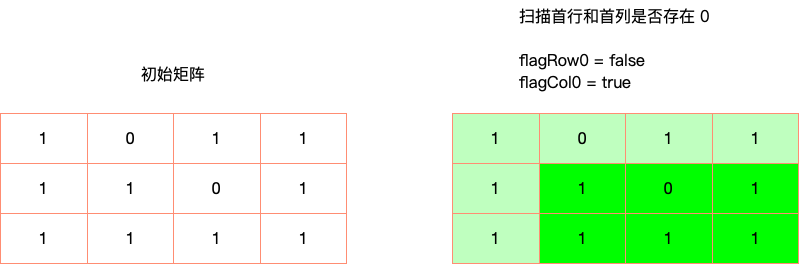
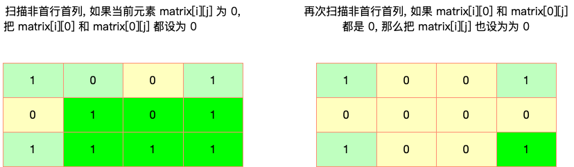
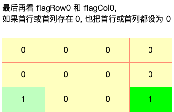

## 题目

给定一个 `m * n` 的矩阵, 如果一个元素为 `0`, 则将其所在行和列的所有元素都设为 `0`, 请使用**原地**算法.

:::note 提示:

- `m == matrix.length`
- `n == matrix[0].length`
- `1 <= m, n <= 200`
- `-2³¹ <= matrix[i][j] <= 2³¹ - 1`

:::

:::note 进阶:

- 一个直观的解决方案是使用 `O(m * n)` 的额外空间, 但这并不是一个好的解决方案.
- 一个简单的改进方案是使用 `O(m + n)` 的额外空间, 但这仍然不是最好的解决方案.
- 你能想出一个仅使用常量空间的解决方案吗?

:::

:::info 示例


```bash
输入: matrix = [[1, 1, 1], [1, 0, 1], [1, 1, 1]]
输出: [[1, 0, 1], [0, 0, 0], [1, 0, 1]]
```


```bash
输入: matrix = [[0, 1, 2, 0], [3, 4, 5, 2], [1, 3, 1, 5]]
输出: [[0, 0, 0, 0], [0, 4, 5, 0], [0, 3, 1, 0]]
```

:::

## 题解

import Tabs from '@theme/Tabs'
import TabItem from '@theme/TabItem'

<Tabs>
  <TabItem value="JavaScript - 两个线性变量" label="JavaScript - 两个线性变量" default>

朴素做法是创建 `rows` 和 `cols` 两个 `HashSet`, 遍历二维数组. 如果 `matrix[i][j]` 为 `0`,
把 `i` 和 `j` 分别存到 `rows` 和 `cols` 之中. 这样再次遍历时, 如果 `i` 或者 `j` 存在于 `HashSet` 中, 说明该元素所在的行或列存在 `0`, 那自然该元素也要变成 `0`.

```ts
/**
 * @param {number[][]} matrix
 * @return {void} Do not return anything, modify matrix in-place instead.
 */
var setZeroes = function (matrix) {
  const m = matrix.length
  const n = matrix[0].length

  const rows = new Set()
  const cols = new Set()
  for (let i = 0; i < m; i++) {
    for (let j = 0; j < n; j++) {
      if (matrix[i][j] === 0) {
        rows.add(i)
        cols.add(j)
      }
    }
  }

  for (let i = 0; i < m; i++) {
    for (let j = 0; j < n; j++) {
      if (rows.has(i) || cols.has(j)) {
        matrix[i][j] = 0
      }
    }
  }
}
```

## 复杂度分析

- 时间复杂度: `O(m * n)`
- 空间复杂度: `O(m + n)`

</TabItem>
<TabItem value="JavaScript - 两个常数级变量" label="JavaScript - 两个常数级变量">

除了使用两个线性级的 `HashSet`, 也可以用两个常数级的变量 `firstRowHasZero` 和 `firstColHasZero`, 用于记录首行或者首列是否存在 `0`.
这样的目的是仅仅先记录首行和首列是否有 `0`, 而不去修改这两行, 因为一旦修改了, 其他行和列就算不准了.



接下来扫描非首行首列, 如果当前元素 `matrix[i][j]` 为 `0`, 那么将对应的 `matrix[i][0]` 和 `matrix[0][j]` 设为 `0`, 这样做的目的是让首行首列来充当那两个 `HashSet`, 有效的减小了时间复杂度.

然后再次扫描非首行首列, 如果当前元素 `matrix[i][j]` 对应的 `matrix[i][0]` 或 `matrix[0][j]` 为 `0`, 说明该元素所在的行或列存在 `0`, 那么将该元素也设为 `0`.



最后根据 `firstRowHasZero` 和 `firstColHasZero` 的情况将首行或首列都置为 `0`.



```ts
var setZeroes = function (matrix) {
  const m = matrix.length
  const n = matrix[0].length

  let firstRowHasZero = false
  let firstColHasZero = false

  // 记录首行是否有 0
  for (let i = 0; i < m; i++) {
    if (matrix[i][0] === 0) {
      firstRowHasZero = true
      break // 找出一个 0 就行
    }
  }

  // 记录首列是否有 0
  for (let j = 0; j < n; j++) {
    if (matrix[0][j] === 0) {
      firstColHasZero = true
      break // 找出一个 0 就行
    }
  }

  // 扫描非首行 / 非首列
  // 如果元素是 0, 将 matrix[i][0] 和 matrix[0][j] 设为 0
  // 其实就相当于在首行 / 首列这两个 哈希表中注册对应的行 / 列是否有 0
  for (let i = 1; i < m; i++) {
    for (let j = 1; j < n; j++) {
      if (matrix[i][j] === 0) {
        matrix[i][0] = matrix[0][j] = 0
      }
    }
  }

  // 扫描非首行 / 非首列
  // 如果哈希表对应的行 / 列是 0, 把该元素也抹零
  for (let i = 1; i < m; i++) {
    for (let j = 1; j < n; j++) {
      if (matrix[i][0] === 0 || matrix[0][j] === 0) {
        matrix[i][j] = 0
      }
    }
  }

  // 如果第一行有 0, 第一行抹零
  if (firstRowHasZero) {
    for (let i = 0; i < m; i++) {
      matrix[i][0] = 0
    }
  }

  // 如果第一列有 0, 第一列抹零
  if (firstColHasZero) {
    for (let j = 0; j < n; j++) {
      matrix[0][j] = 0
    }
  }
}
```

## 复杂度分析

- 时间复杂度: `O(m * n)`
- 空间复杂度: `O(1)`

</TabItem>
<TabItem value="Rust" label="Rust">

```rust
pub fn set_zeroes(matrix: &mut Vec<Vec<i32>>) {
    let m = matrix.len();
    let n = matrix[0].len();
    let mut flag_row_0 = false;
    let mut flag_col_0 = false;

    for i in 0..m {
        if matrix[i][0] == 0 {
            flag_row_0 = true;
            break;
        }
    }

    for j in 0..n {
        if matrix[0][j] == 0 {
            flag_col_0 = true;
            break;
        }
    }

    for i in 1..m {
        for j in 1..n {
            if matrix[i][j] == 0 {
                matrix[i][0] = 0;
                matrix[0][j] = 0;
            }
        }
    }

    for i in 1..m {
        for j in 1..n {
            if matrix[i][0] == 0 || matrix[0][j] == 0 {
                matrix[i][j] = 0;
            }
        }
    }

    if flag_row_0 {
        for i in 0..m {
            matrix[i][0] = 0
        }
    }

    if flag_col_0 {
        for j in 0..n {
            matrix[0][j] = 0
        }
    }
}
```

</TabItem>
</Tabs>
