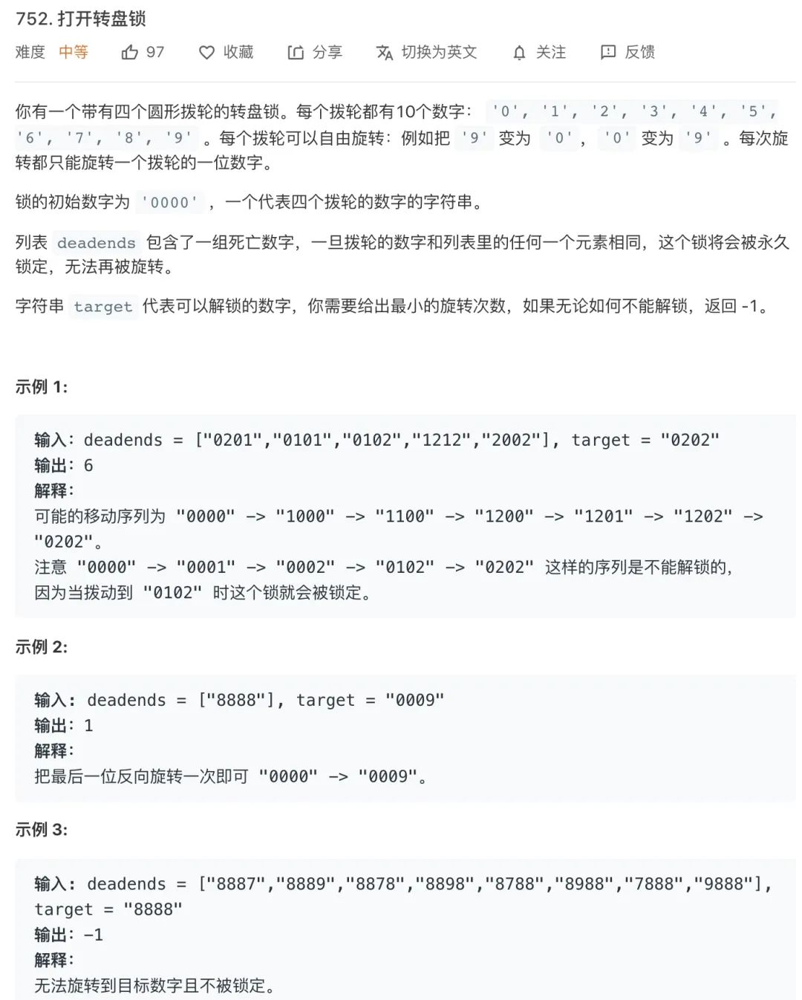

:::success Tips
题目类型: BFS
:::

## 题目



:::info 示例

输入: deadends = ['8888'], target = '0009'

输出: 1

解释: 把 0000 的最后一位反向旋转一次即可 0000 -> 0009
:::

## 题解

我们先不考虑 deadends 和 target, 只是来穷举所有的可能. 每次旋转只能旋转一个拨轮的一位数字, 以为 0000 为例, 旋转一次就会有 8 种可能, 分别是 0001, 0009, 0010, 0090, 0100, 0900, 1000, 9000. 然后再以这 8 种密码作为基础, 穷举出所有可能... **回到原题, 其实这就好比一幅图, 每个节点有 8 个子节点, 然后求最短路径, 这也就是 BFS 了.**

```ts
const plus = (str, i) => {
  const arr = str.split('')

  if (+arr[i] === 9) {
    arr[i] = 0
  } else {
    arr[i] = +arr[i] + 1
  }

  return arr.join('')
}

// 向下拨动一次
const minus = (str, i) => {
  const arr = str.split('')
  if (+arr[i] === 0) {
    arr[i] = 9
  } else {
    arr[i] = +arr[i] - 1
  }

  return arr.join('')
}

/**
 * @param {string[]} deadends
 * @param {string} target
 * @return {number}
 */
var openLock = function (deadends, target) {
  const deads = new Set(deadends)
  const queue = ['0000']
  const visited = new Set(['0000'])
  let step = 0

  while (queue.length !== 0) {
    const len = queue.length

    // 将当前队列中的所有节点向周围扩散
    for (let i = 0; i < len; i++) {
      const curr = queue.shift()

      // 跳过死亡密码
      if (deads.has(curr)) continue

      // 找到了结果, 返回
      if (curr === target) return step

      // 将一个节点的相邻节点加入队列
      for (let j = 0; j < 4; j++) {
        const up = plus(curr, j)
        // 避免拨到已经拨过的密码
        if (!visited.has(up)) {
          queue.push(up)
          visited.add(up)
        }

        const down = minus(curr, j)
        // 避免拨到已经拨过的密码
        if (!visited.has(down)) {
          queue.push(down)
          visited.add(down)
        }
      }
    }
    step++
  }

  // 如果穷举完都没找到目标密码, 那就是找不到了
  return -1
}
```
