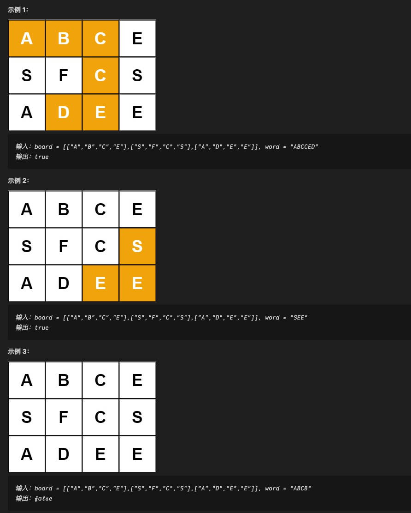

:::success Tips
题目类型: BackTracking
:::

## 题目

给定一个 m x n 二维字符网格 board 和一个字符串单词 word. 如果 word 存在于网格中, 返回 true; 否则, 返回 false.

单词必须按照字母顺序, 通过相邻的单元格内的字母构成, 其中"相邻"单元格是那些水平相邻或垂直相邻的单元格. 同一个单元格内的字母不允许被重复使用.



## 题解

```ts
/**
 * @param {character[][]} board
 * @param {string} word
 * @return {boolean}
 */
var exist = function (board, word) {
  const m = board.length
  const n = board[0].length
  const len = word.length
  const used = new Array(m)
  for (let i = 0; i < m; i++) {
    used[i] = new Array(n).fill(false)
  }

  // row 和 col 当前点的坐标, i 当前考察的 word 字符索引
  const backtracking = (row, col, i) => {
    // 递归的出口: i 越界了就返回 true
    if (i === len) return true

    // 当前点越界, 返回 false
    if (row < 0 || row >= m || col < 0 || col >= n) return false

    // 当前点已经访问过, 或非目标点
    if (used[row][col] || board[row][col] !== word[i]) return false

    used[row][col] = true

    const canFindRest =
      backtracking(row + 1, col, i + 1) ||
      backtracking(row - 1, col, i + 1) ||
      backtracking(row, col + 1, i + 1) ||
      backtracking(row, col - 1, i + 1)

    if (canFindRest) return true

    used[row][col] = false

    return false
  }

  for (let i = 0; i < m; i++) {
    for (let j = 0; j < n; j++) {
      if (board[i][j] === word[0] && backtracking(i, j, 0)) return true
    }
  }

  return false
}
```
