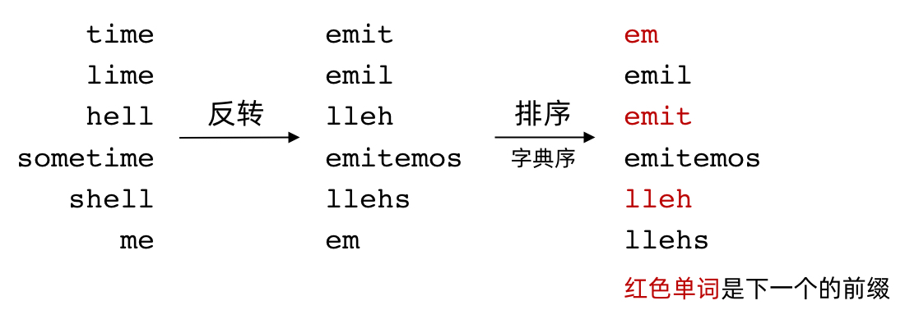

## 题目

单词数组 `words` 的 有效编码 由任意助记字符串 `s` 和下标数组 `indices` 组成, 且满足:

- `words.length == indices.length`
- 助记字符串 `s` 以 `'#'` 字符结尾
- 对于每个下标 `indices[i]`, `s` 的一个从 `indices[i]` 开始、到下一个 `'#'` 字符结束(但不包括 `'#'`)的**子字符串**恰好与 `words[i]` 相等
  给你一个单词数组 `words`, 返回成功对 `words` 进行编码的最小助记字符串 `s` 的长度.

:::info 示例

输入: `words = ["time", "me", "bell"]`

输出: `10`

解释: 一组有效编码为 `s = "time#bell#"` 和 `indices = [0, 2, 5].`

`words[0] = "time"`, `s` 开始于 `indices[0] = 0` 到下一个 `'#'` 结束的子字符串, 如加粗部分所示 "**time**#bell#"

`words[1] = "me"`, `s` 开始于 `indices[1] = 2` 到下一个 `'#'` 结束的子字符串, 如加粗部分所示 "ti**me**#bell#"

`words[2] = "bell"`, `s` 开始于 `indices[2] = 5` 到下一个 `'#'` 结束的子字符串, 如加粗部分所示 "time#**bell**#"

:::

## 题解



整体的思路就是先把 `words` 中的字符串反转, 然后按照字典序排序. 这样保证了 `reversedWords` **靠前的字符串有可能是它下一个的前缀**. 所以当这个条件成立的话, 当前这个 word(实际就是个前缀), 就可以被下个 word **吸收**, 那当前这个 word 就可以被省略.

import Tabs from '@theme/Tabs'
import TabItem from '@theme/TabItem'

<Tabs>
  <TabItem value="JavaScript" label="JavaScript" default>

```ts
/**
 * @param {string[]} words
 * @return {number}
 */
var minimumLengthEncoding = function (words) {
  const n = words.length
  const reversedWords = []
  for (const word of words) {
    reversedWords.push(word.split('').reverse().join(''))
  }
  reversedWords.sort()

  let res = 0
  for (let i = 0; i < n; i++) {
    const currWord = reversedWords[i]
    // 如果当前单词是下个单词的前缀, 这个单词就可以被吸收
    if (!(i < n - 1 && reversedWords[i + 1].startsWith(currWord))) {
      res += currWord.length + 1
    }
  }

  return res
}
```

</TabItem>
<TabItem value="Rust" label="Rust">

```rust
pub fn minimum_length_encoding(words: Vec<String>) -> i32 {
    let n = words.len();
    let mut reversed_words = Vec::with_capacity(n);

    for val in words {
        reversed_words.push(val.chars().rev().collect::<String>());
    }

    reversed_words.sort();

    let mut ans = 0;

    for (key, _) in reversed_words.iter().enumerate() {
        let curr_word = &reversed_words[key];
        if !(key < n - 1 && reversed_words[key + 1].starts_with(curr_word)) {
            ans += curr_word.len() + 1;
        }
    }

    ans as i32
}

```

</TabItem>
</Tabs>
