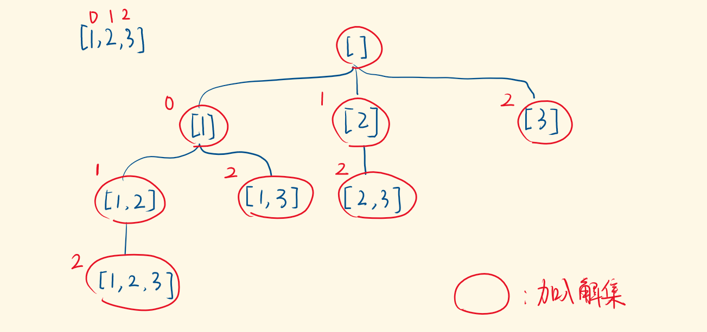

## 题目

给定一个**可能包含重复元素**的整数数组 nums, 返回该数组所有可能的子集.

说明: 解集不能包含重复的子集.

:::info 示例

输入: `[1, 2, 2]`

输出: `[ [], [ 1 ], [ 1, 2 ], [ 1, 2, 2 ], [ 2 ], [ 2, 2 ] ]`
:::

## 题解



本题是 [78. 组合总数](/leetcode/medium/78-subsets) 的一个变种, 核心思想看这篇文章即可, 只不过本题加入了**可能包含重复元素**的情况, 直接套用 visited 大法即可.

```js
/**
 * @param {number[]} nums
 * @return {number[][]}
 */
var subsetsWithDup = function (nums) {
  const len = nums.length
  const res = []
  const visited = new Array(len).fill(false)
  nums.sort((a, b) => a - b)

  const dfs = (index, track) => {
    res.push(track.slice())

    for (let i = index; i < len; i++) {
      if (nums[i - 1] === nums[i] && i - 1 >= 0 && !visited[i - 1]) continue
      if (visited[i]) continue

      track.push(nums[i])
      visited[i] = true
      dfs(i + 1, track)
      track.pop()
      visited[i] = false
    }
  }

  dfs(0, [])

  return res
}
```
