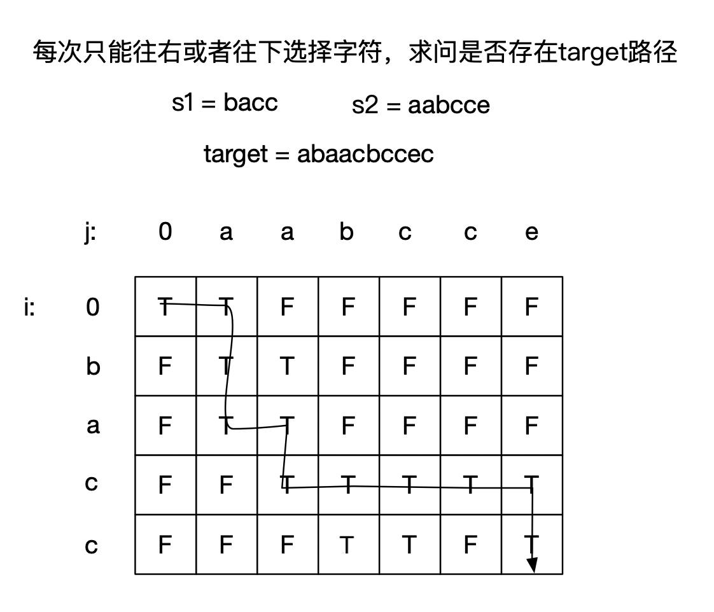

:::success Tips
题目类型: Dynamic Programming
:::

## 题目

给定三个字符串 `s1`, `s2`, `s3`, 请你帮忙验证 `s3` 是否是由 `s1` 和 `s2` **交错**组成的. 要求使用 `O(s2.length)` 额外的内存空间来解决.

两个字符串 `s` 和 `t` **交错**的定义与过程如下, 其中每个字符串都会被分割成若干**非空**子字符串:

- `s = s1 + s2 + ... + sn`
- `t = t1 + t2 + ... + tm`
- `|n - m| <= 1`
- **交错**是 `s1 + t1 + s2 + t2 + s3 + t3 + ...` 或者 `t1 + s1 + t2 + s2 + t3 + s3 + ...`

注意: `a + b` 意味着字符串 `a` 和 `b` 连接.

提示:

- `0 <= s1.length, s2.length <= 100`
- `0 <= s3.length <= 200`
- `s1`, `s2`, 和 `s3` 都由小写英文字母组成

:::info 示例


输入: `s1 = "aabcc", s2 = "dbbca", s3 = "aadbbcbcac"`

输出: `true`
:::

## 题解

这道题如果能看出来可以转换成下面这种形态就好办了. 它就是 [64. 最小路径和](/leetcode/medium/64-min-path-sum) 的变种题, 即每次只能往右或往下选择字符, 是否存在路径可以从左上角到右下角.



import Tabs from '@theme/Tabs'
import TabItem from '@theme/TabItem'

<Tabs>
  <TabItem value="JavaScript" label="JavaScript" default>

于是可定义二维数组 `dp`, `dp[i][j]` 代表 `s1` 前 `i` 个字符与 `s2` 前 `j` 个字符拼接成 `s3` 的 `i + j` 个字符, 也就是存在目标路径能够到达 `i, j`.

状态转移方程:

- `dp[0][0] = true`
- 第一列只能一直往下走, 此时如果 `s1[i - 1] === s3[i - 1]`, 有 `dp[i][0] = true`
- 第行列只能一直往右走, 此时如果 `s2[j - 1] === s3[j - 1]`, 有 `dp[0][j] = true`
- 其他情况, 到达 `dp[i][j]` 可能由 `dp[i - 1][j]` 到达, 也可能由 `dp[i][j - 1]` 到达, 因此有 `dp[i][j] = (dp[i - 1][j] && s1[i - 1] === s3[i + j - 1]) || (dp[i][j - 1] && s2[j - 1] === s3[i + j - 1])`

```ts
/**
 * @param {string} s1
 * @param {string} s2
 * @param {string} s3
 * @return {boolean}
 */
var isInterleave = function (s1, s2, s3) {
  const m = s1.length
  const n = s2.length
  if (m + n !== s3.length) return false

  const dp = new Array(m + 1)
    .fill(false)
    .map(() => new Array(n + 1).fill(false))
  dp[0][0] = true

  for (let i = 1; i <= m && s1[i - 1] === s3[i - 1]; i++) dp[i][0] = true
  for (let j = 1; j <= n && s2[j - 1] === s3[j - 1]; j++) dp[0][j] = true
  for (let i = 1; i <= m; i++) {
    for (let j = 1; j <= n; j++) {
      dp[i][j] =
        (dp[i - 1][j] && s1[i - 1] === s3[i + j - 1]) ||
        (dp[i][j - 1] && s2[j - 1] === s3[i + j - 1])
    }
  }

  return dp[m][n]
}
```

</TabItem>
<TabItem value="Rust" label="Rust">

```rust
pub fn is_interleave(s1: String, s2: String, s3: String) -> bool {
    let (s1, s2, s3) = (s1.as_bytes(), s2.as_bytes(), s3.as_bytes());
    let (n1, n2, n3) = (s1.len(), s2.len(), s3.len());
    if n1 + n2 != n3 { return false; }


    let mut dp = vec![vec![false; n2 + 1]; n1 + 1];
    dp[0][0] = true;

    for i in 1..=n1 {
        match s1[i - 1] == s3[i - 1] {
            true => dp[i][0] = true,
            false => break,
        }
    }

    for j in 1..=n2 {
        match s2[j - 1] == s3[j - 1] {
            true => dp[0][j] = true,
            false => break,
        }
    }

    for i in 1..=n1 {
        for j in 1..=n2 {
            dp[i][j] = (dp[i - 1][j] && s1[i - 1] == s3[i + j - 1])
                || (dp[i][j - 1] && s2[j - 1] == s3[i + j - 1]);
        }
    }

    dp[n1][n2]
}
```

</TabItem>
</Tabs>
