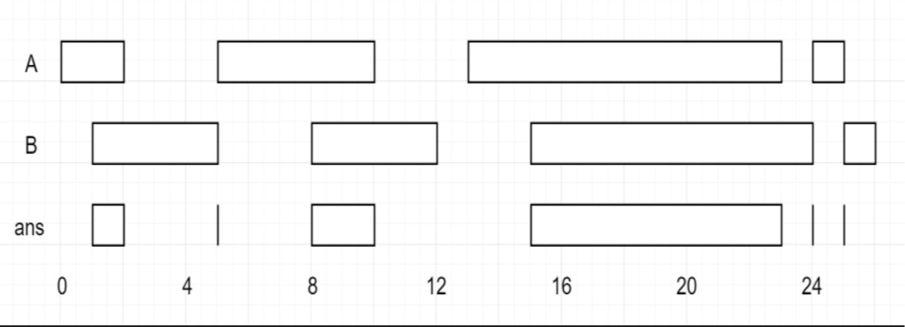
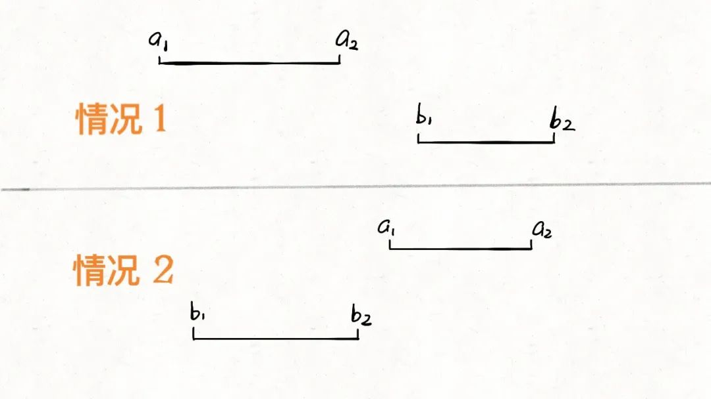
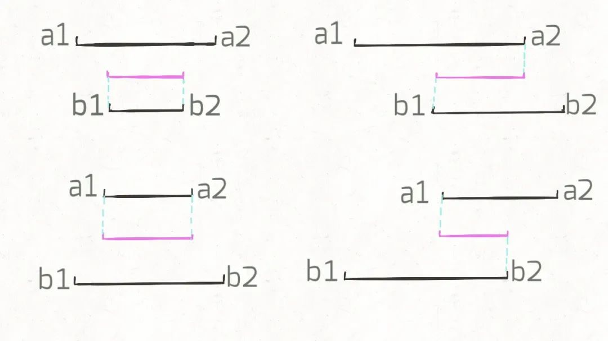

## 题目

给定两个由一些**闭区间**组成的列表, `firstList` 和 `secondList`, 其中 firstList[i] = [start<sub>i</sub>, end<sub>i</sub>] 而 secondList[j] = [start<sub>j</sub>, end<sub>j</sub>]. 每个区间列表都是成对**不相交**的, 并且已经**排序**. 返回这两个区间列表的交集.

形式上, 闭区间 [a, b] (其中 `a <= b`) 表示实数 x 的集合, 而 `a <= x <= b`.

两个闭区间的交集是一组实数, 要么为空集, 要么为闭区间. 例如, [1, 3] 和 [2, 4] 的交集为 [2, 3].

:::info 示例


输入: `firstList = [[0,2], [5,10], [13,23], [24,25]], secondList = [[1,5], [8,12], [15,24], [25,26]]`

输出: `[[1, 2], [5, 5], [8, 10], [15, 23], [24, 24], [25, 25]]`
:::

## 题解

看到区间问题先要做排序, 因为该题的数组已经排序了, 这里就不用 care 了. 因为是找交集, 可以先反着看, 即什么情况下是没有交集的. 通过下图可以发现, `a2 < b1 || b2 < a1` 时, 是没有交集的; 反过来, 也就是 `a2 >= b1 && b2 >= a1` 时, 才会有交集.



接着我们把所有交集的情况列出来, 如下图所示, 可以看到对于交集 `[c1, c2]`, 那么 `c1 = Math.max(a1, b1)`, `c2 = Math.min(a2,b2)`.



最后, `b2 < a2` 时, `j` 向右移动, 否则 `i` 向右移动.


```ts
/**
 * @param {number[][]} firstList
 * @param {number[][]} secondList
 * @return {number[][]}
 */
var intervalIntersection = function (firstList, secondList) {
  const firstListLen = firstList.length
  const secondListLen = secondList.length
  let i = 0,
    j = 0
  const res = []

  while (i < firstListLen && j < secondListLen) {
    const a1 = firstList[i][0]
    const a2 = firstList[i][1]
    const b1 = secondList[j][0]
    const b2 = secondList[j][1]

    if (b2 >= a1 && a2 >= b1) {
      res.push([Math.max(a1, b1), Math.min(a2, b2)])
    }

    if (b2 < a2) {
      j += 1
    } else {
      i += 1
    }
  }

  return res
}
```
