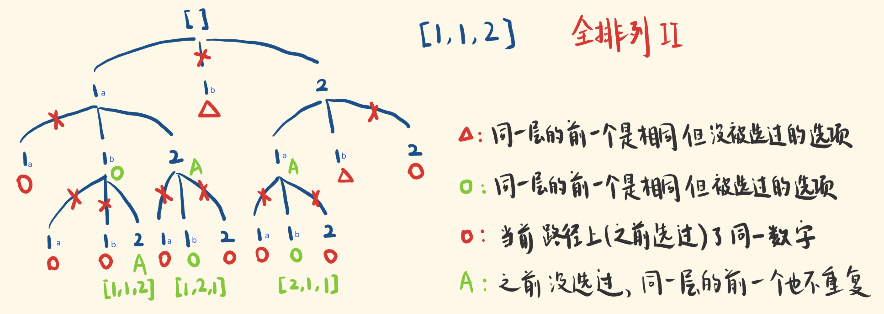

## 题目

给定一个 `有重复` 数字的序列, 按任意顺序返回所有不重复的全排列.

:::info 示例
输入: `[1,1,2]`

输出:
`[ [1,1,2], [1,2,1], [2,1,1] ]`
:::

## 题解



遇到回溯算法, 先把决策树画出来, 我们能发现两条规律, 为了表示两个 1 代表不同的意义, 这里用 1<sub>a</sub> 和 1<sub>b</sub> 表示:

1. 如果在一条路径上, 一个相同的数字已经被选择过了, 那这条路径需要被废弃掉, 也就是上图**红色圆形**标注的部分. 比如最左边的 1<sub>a</sub> -> 1<sub>a</sub> 这条, 抑或是 1<sub>a</sub> -> 1<sub>b</sub> -> 1<sub>a</sub> 这条.

2. 在"同一层" 如果相邻的两个数字相同, 那它们生成的子树一定是相同的, 因此需要过滤掉一个, 也就是上图**红色三角形**标注的部分. 但要注意的是, **如果同一层一个值已经被用过了, 即便它右边的值与之相等, 右边这个值不会被过滤掉**, 比如第二层左侧的 1<sub>a</sub> -> 1<sub>b</sub> -> 2, 因为 1<sub>a</sub> 在第一条规则中已经被剪掉了, 1<sub>b</sub> 即便和 1<sub>a</sub> 相等, 也不会被剪掉.

:::caution
注意: 为保证相邻两个可以正常比较, 需要先对给定数组做一次排序.
:::

```js
/**
 * @param {number[]} nums
 * @return {number[][]}
 */
var permuteUnique = function (nums) {
  const res = []
  const track = []
  const len = nums.length
  const used = new Array(len).fill(false)
  nums.sort((a, b) => a - b) // 排序

  const backtrack = (track) => {
    if (track.length === len) {
      res.push(track)
      return
    }
    for (let i = 0; i < len; i++) {
      // 对应第二条规则: 相邻两个值相等 && 保证数组不越界 && 保证前一个没被用过
      if (nums[i - 1] === nums[i] && i - 1 >= 0 && !used[i - 1]) {
        continue
      }

      // 对应第一条规则: 这个数使用过了, 跳过
      if (used[i]) {
        continue
      }
      track.push(nums[i]) // 做选择
      used[i] = true // 记录路径上做过的选择
      backtrack(track.slice()) // 递归
      track.pop() // 撤销选择
      used[i] = false // 也要撤销一下对它的记录
    }
  }

  backtrack(track)
  return res
}
```
